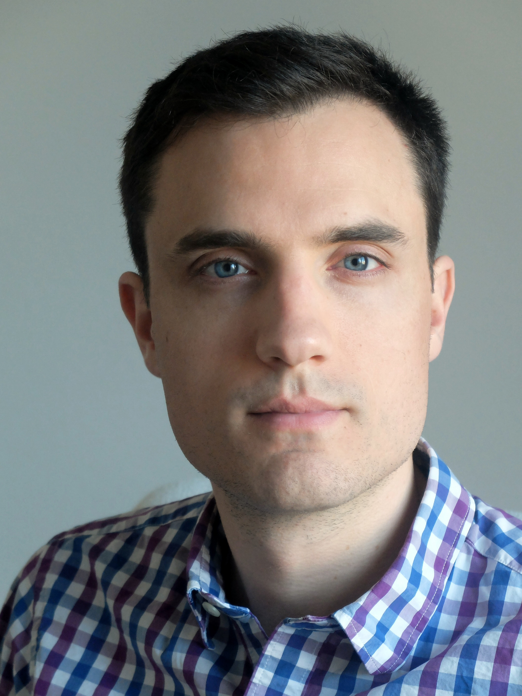

After a Marie Curie fellowship in between UC San Francisco, Stanford and the ETH Zurich, I just started as an Assistant Professor (_Maître de Conférence_) in the [Mechanics Department](https://www.polytechnique.edu/education/departements-denseignement-et-de-recherche/departement-de-mecanique)/[Solid Mechanics Laboratory](https://lms.ip-paris.fr) at [École Polytechnique](https://www.polytechnique.edu), with research position in the [MΞDISIM team](https://m3disim.saclay.inria.fr) of [INRIA](https://www.inria.fr).

