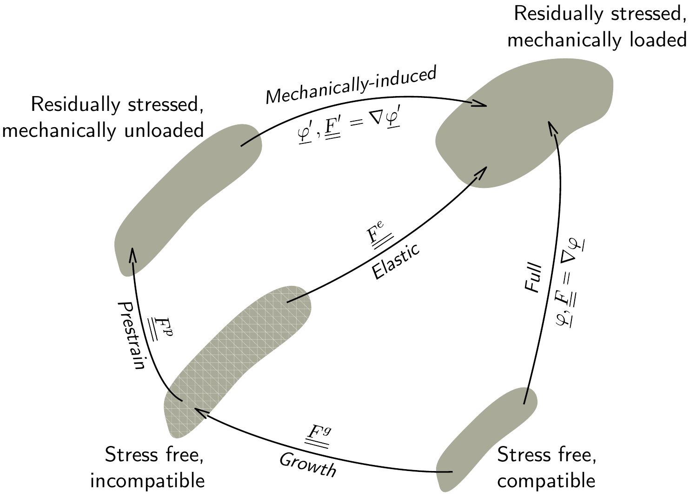
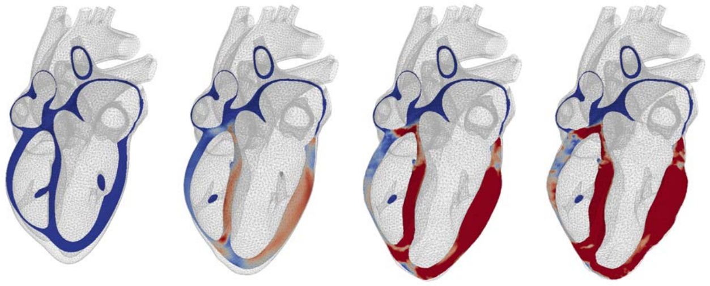

{width="50%" fig-align="center"}

{width="50%" fig-align="center"}

**Context** Living tissues are made of highly complex hierarchical materials, with a large number of biochemical/biophysical mechanisms interacting at various spatial and temporal scales. This complexity can be addressed through modern modeling and simulation methods (e.g., multi-physics coupling, homogenization, model reduction, etc.), in close interaction with experimental assays. This leads to a better understanding of living tissues, the ultimate goal being to develop objective and quantitative diagnostic and prognostic tools for the clinic—biomedical engineering. The team has already proposed detailed models of cardiac poromechanics \[[1](https://hal.inria.fr/inria-00520612v3)\], electromechanics \[[2](https://hal.inria.fr/inria-00542779),[3](https://hal.inria.fr/hal-00678772)\] and hypertrophy \[[4](https://www.dropbox.com/s/o5bf88hhhuvps6f/Genet%20et%20al.%20-%202015%20-%20Heterogeneous%20growth-induced%20prestrain%20in%20the%20heart.pdf?dl=0),[5](https://www.dropbox.com/s/savbqtw3flbfaxh/Genet%20et%20al.%20-%202015%20-%20Modeling%20Pathologies%20of%20Diastolic%20and%20Systolic%20Heart%20Failure.pdf?dl=0)\], whose coupling raises important fundamental and technical questions.

**Objectives** The PhD will aim at developing a modeling and simulation framework including multiple strongly coupled spatial and temporal scales. In terms of spatial scales, the mechanisms driving the tissue’s chronic evolution at small scales (cellular growth, extracellular remodeling, etc.) will be introduced in the electromechanical model developed in the team, and homogenized (relying in particular on the method of the multiplicative decomposition of the transformation gradient) to generate the macroscopic behavior. In terms of temporal scales, a method will be developed to accelerate the resolution of periodic solutions of the cardiac cycle, and indirectly simulate a very large number of cycles. The work will focus on specific remodeling conditions, including cardiac hypertrophy induced by myocardial infarction and cardiac amyloidosis, around which the team develops experimental protocols in collaboration with the clinical world.

**Candidate Profile** The candidate must master continuum mechanics, with preferably (but not necessarily) a good knowledge of large transformations and biomechanics. He/She will also have a marked interest in the cardiac application, especially for the interaction with the clinical collaborators.

**Work environment** The work will take place within the [MΞDISIM](https://m3disim.saclay.inria.fr) team (a joint team of Inria & École Polytechnique), which is located on the École Polytechnique campus.

**Contacts / Applications** For more information, you may contact \martin.genet@polytechnique.edu and dominique.chapelle@inria.fr.
Applications should be submitted online on the [Paris-Saclay / ADUM system](http://www.adum.fr/as/ed/voirpropositionT.pl?site=PSaclay&matricule_prop=10994), but we recommend that you also contact us via the above email addresses to prepare your application.

**Bibliography**\
\[1\] [Chapelle and Moireau, 2014. A poroelastic model valid in large strains with applications to perfusion in cardiac modeling. European Journal of Mechanics - B/Fluids.](https://hal.inria.fr/inria-00520612v3)\
\[2\] [Chapelle, et al., 2009. Numerical Simulation of the Electromechanical Activity of the Heart, Functional Imaging and Modeling of the heart.](https://hal.inria.fr/inria-00542779)\
\[3\] [Chapelle, et al., 2012. Energy-preserving muscle tissue model: formulation and compatible discretizations, International Journal for Multiscale Computational Engineering.](https://hal.inria.fr/hal-00678772)\
\[4\] [Genet, et al., 2015. Heterogeneous growth-induced prestrain in the heart, Journal of Biomechanics.](https://www.dropbox.com/s/o5bf88hhhuvps6f/Genet%20et%20al.%20-%202015%20-%20Heterogeneous%20growth-induced%20prestrain%20in%20the%20heart.pdf?dl=0)\
\[5\] [Genet, et al., 2015. Modeling Pathologies of Diastolic and Systolic Heart Failure, Annals of Biomedical Eng.](https://www.dropbox.com/s/savbqtw3flbfaxh/Genet%20et%20al.%20-%202015%20-%20Modeling%20Pathologies%20of%20Diastolic%20and%20Systolic%20Heart%20Failure.pdf?dl=0)
