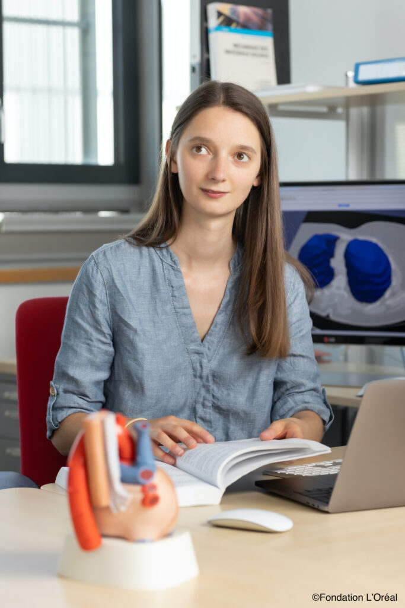

[Cécile Patte](https://m3disim.saclay.inria.fr/people/cecile-patte), 3rd-year PhD student in the team with [Dominique Chapelle](https://m3disim.saclay.inria.fr/people/dominique-chapelle) and I, received the 2020 French Young Talent award of the programme "For Women in Science" L'Oréal - Unesco.
This prize rewards her research work on pulmonary poromechanics modeling applied to pulmonary fibrosis.

{width="50%" fig-align="center"}
