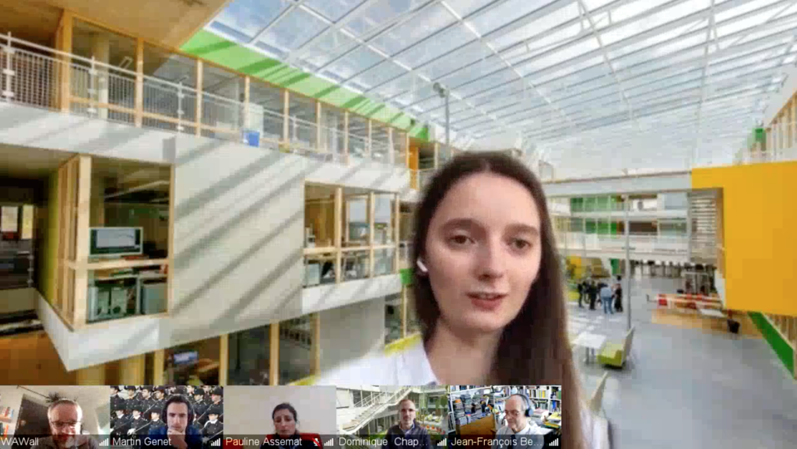

Today Cécile Patte defended her thesis!
Reviewers of the thesis were:

- [Stéphane Avril](https://www.mines-stetienne.fr/author/avril), Professor, Mines de Saint-Étienne, France
- [Merryn Tawhai](https://profiles.auckland.ac.nz/m-tawhai), Professor, University of Auckland, New Zealand

And the jury was composed of:

- [Wolfgang A. Wall](https://www.epc.ed.tum.de/lnm/staff/wall), Professor, Technical University of Munich, Germany _(President)_
- [Stéphane Avril](https://www.mines-stetienne.fr/author/avril), Professor, Mines de Saint-Étienne, France _(Reviewer)_
- [Pauline Assemat](https://www.imft.fr/annuaire/assemat-pauline), CNRS Researcher, IMF Toulouse, France _(Examiner)_
- [Aline Bel-Brunon](https://lamcos.insa-lyon.fr/fiche_personnelle.php?p=33&Numpers=616&L=1), Maître de Conférences, INSA Lyon, France _(Examiner)_
- Jean-François Bernaudin, Emeritus Professor, Sorbonne University, France _(Examiner)_
- [Nicolas Triantafyllidis](https://www.polytechnique.edu/en/directory/triantafyllidis-nicolas), CNRS Research Director, École Polytechnique _(Examiner)_
- [Dominique Chapelle](https://m3disim.saclay.inria.fr/people/dominique-chapelle), Inria Research Director, France _(PhD Advisor)_
- [Martin Genet](https://m3disim.saclay.inria.fr/people/martin-genet), Maître de Conférences, École Polytechnique _(PhD Advisor)_

Congrats Cécile and best wishes for the future!!

By the way, her PhD thesis is available at [https://theses.hal.science/tel-03144413](https://theses.hal.science/tel-03144413).

{width="50%" fig-align="center"}
