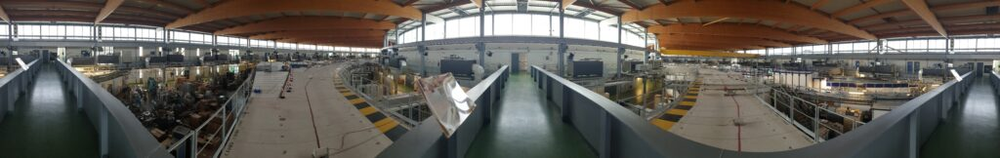

[Jean-Marc Allain](https://m3disim.saclay.inria.fr/people/jean-marc-allain) & I (with the help of Anne-Gaëlle Eveno) are currently making microstructural images of hearts and lungs at the [SOLEIL synchrotron](https://www.synchrotron-soleil.fr) ([ANATOMIX beamline](https://www.synchrotron-soleil.fr/en/beamlines/anatomix), managed by Timm Weitkamp & Mario Scheel). Stay tuned for the results!

{width="50%" fig-align="center"}
