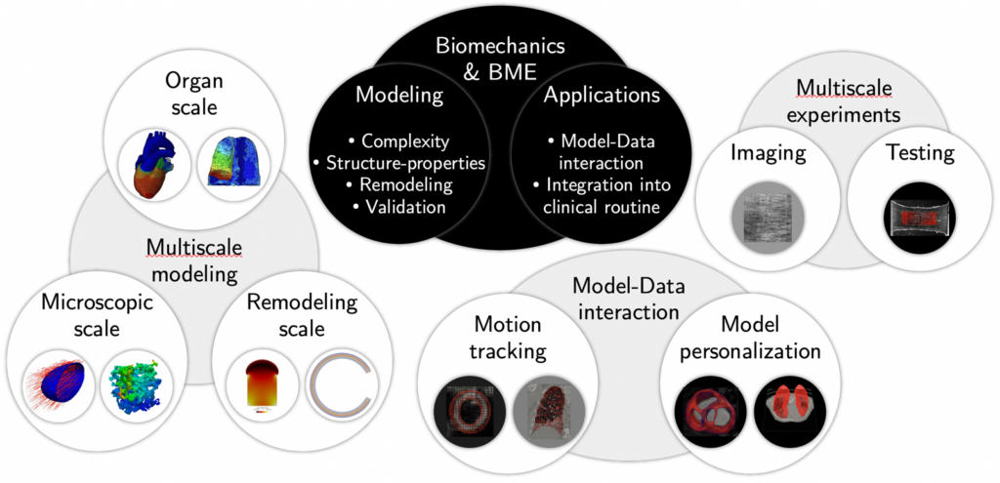

Today I defended my habilitation thesis, entitled "Some contributions to cardiac and pulmonary biomechanical modeling, simulation & estimation", in front of an impressive international jury:

- [Patrick Le Tallec](https://ppi-lms.polytechnique.fr/patrick.letallec/) (Professor, École Polytechnique, Palaiseau, France)
- [Alain Goriely](http://goriely.com) (Professor, University of Oxford, United Kingdom)
- [Gerhard Holzapfel](https://www.biomech.tugraz.at/people/gerhard_holzapfel) (Professor, Graz University of Technology, Austria)
- [Merryn Tawhai](https://profiles.auckland.ac.nz/m-tawhai) (Professor, University of Auckland, New Zealand)
- [Stéphane Avril](https://www.mines-stetienne.fr/author/avril/) (Professor, École des Mines de Saint-Etienne, France)
- [Patrick Clarysse](https://www.creatis.insa-lyon.fr/site/fr/users/clarysse) (Research Director, CREATIS/CNRS, Lyon, France)

You can find my habilitation manuscript on HAL: [https://hal.archives-ouvertes.fr/tel-03698102](https://hal.archives-ouvertes.fr/tel-03698102).

{width="50%" fig-align="center"}
