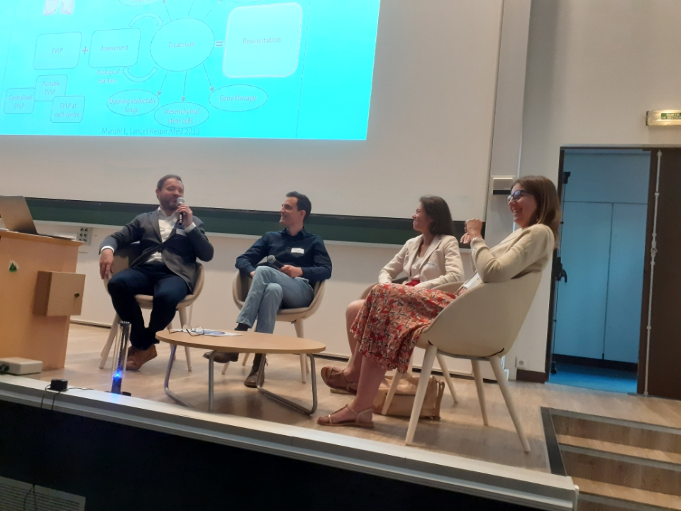

Today I shared some views on the future of pulmonology during a round table with [Olaf Mercier](https://fr.linkedin.com/in/olaf-mercier-87389668) (Hôpital Marie Lannelongue - Groupe Hospitalier Paris Saint Joseph), [Irène Vignon-Clémentel](https://team.inria.fr/simbiotx/team-members/irene-vignon-clementel) (INRIA) & [Caroline Caramella](https://fr.linkedin.com/in/caroline-caramella-88b9231a6) (Hôpital Marie Lannelongue - Groupe Hospitalier Paris Saint Joseph) on "The lung - platform for integration and innovation" at the [1st Annuel Forum of the E4H program at École Polytechnique](https://www.ip-paris.fr/e4h-1st-annuel-forum-programme).

{width="50%" fig-align="center"}
