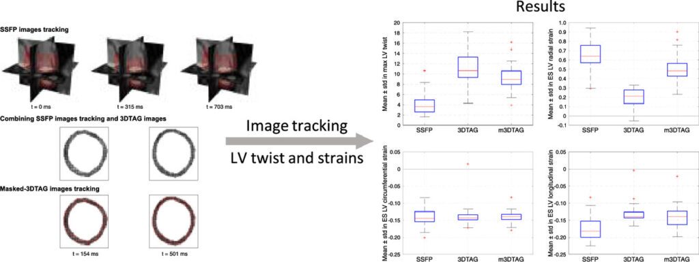

Together with [Ezgi Berberoğlu](https://m3disim.saclay.inria.fr/people/ezgi-berberoglu) we just published a paper in [Medical Image Analysis](https://www.sciencedirect.com/journal/medical-image-analysis), in collaboration with [Christian Stoeck](https://biomed.ee.ethz.ch/institute/People/person-detail.html?persid=114629) and [Sebastian Kozerke](https://biomed.ee.ethz.ch/institute/People/person-detail.html?persid=61641) from the [Institute for Biomedical Engineering of the ETH-Zurich](https://biomed.ee.ethz.ch).

Click [here](https://authors.elsevier.com/a/1ffsq4rfPmACa7) to read the article!

{width="50%" fig-align="center"}
