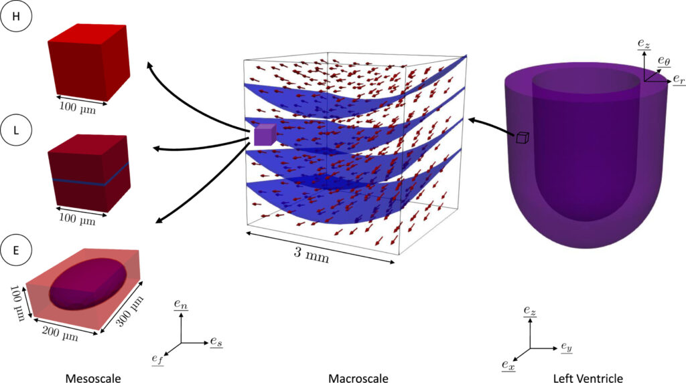

[Nicole Tueni](https://www.linkedin.com/in/nicole-tueni), [Jean-Marc Allain](https://m3disim.saclay.inria.fr/people/jean-marc-allain) and I just published a paper in the [Journal of the Mechanical Behavior of Biomedical Materials](https://www.sciencedirect.com/journal/journal-of-the-mechanical-behavior-of-biomedical-materials).

Click [here](https://authors.elsevier.com/sd/article/S1751-6161\(22\)00505-7) to read the article!

{width="50%" fig-align="center"}
