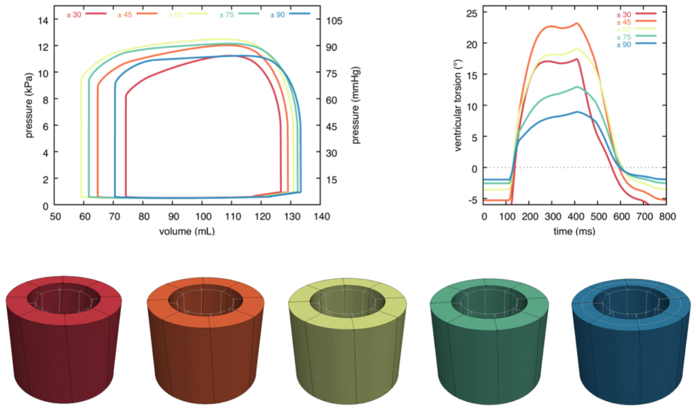

Together with [Jérôme Diaz](https://m3disim.saclay.inria.fr/people/jerome-diaz), [Dominique Chapelle](https://m3disim.saclay.inria.fr/people/dominique-chapelle) & [Philippe Moireau](https://m3disim.saclay.inria.fr/people/philippe-moireau), we just introduced a new —intermediate— level in the [MΞDISIM team](https://m3disim.saclay.inria.fr) team's cardiac model hierarchy (3D & reduced "spherical" model) with a reduced "cylindrical" model: [https://dx.doi.org/10.1002/cnm.3711](https://dx.doi.org/10.1002/cnm.3711)

You can find our preprint on HAL: [https://hal.science/hal-03832575](https://hal.science/hal-03832575)

{width="50%" fig-align="center"}
