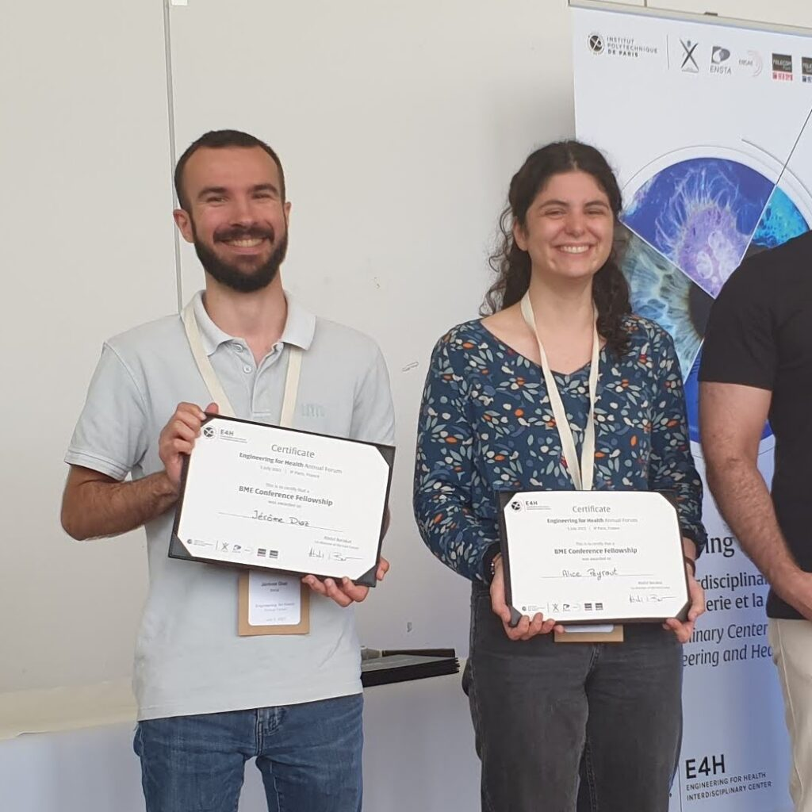

Today we were present at [the second E4H forum](https://www.ip-paris.fr/en/news/engineering-health-annual-forum-2023):

- [Alice Peyraut](https://m3disim.saclay.inria.fr/people/alice-peyraut) presented a posted on Uncertainty Quantification in Personalized Pulmonary Mechanics

- [Mahdi Manoochehrtayebi](https://m3disim.saclay.inria.fr/people/mahdi-manoochehrtayebi) & [Alice Peyraut](https://m3disim.saclay.inria.fr/people/alice-peyraut) received a BME Conference Award

- Kateřina Škardová (Department of Mathematics, Czech Technical University, Prague) received a [E4H Postdoctoral Fellowship](https://www.ip-paris.fr/en/research/research-departments-laboratories-centers-and-projects/disciplinary-and-interdisciplinary-centers/e4h-interdisciplinary-center-engineering-health/postdoctoral-fellowship-program)—she will arrive in the team in August and work on Multiscale Modeling and Simulation of Remodeling in Pulmonary Fibrosis.

{width="50%" fig-align="center"}
