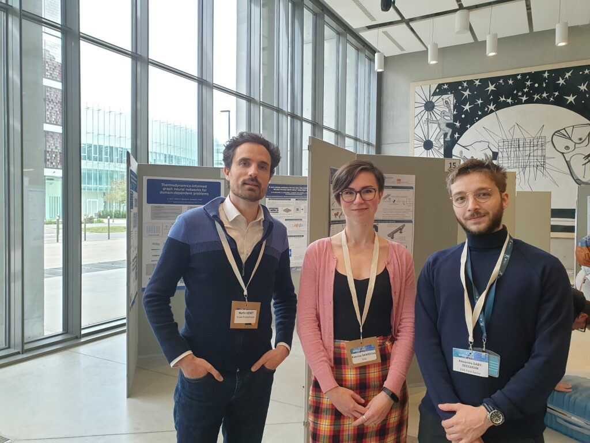

[Kateřina Škardová](https://m3disim.saclay.inria.fr/people/katerina-skardova) and I are attending [MORTech 2023](https://mortech2023.sciencesconf.org) (6th International Workshop on Model Reduction Techniques) at Laboratoire de Mécanique de Paris-Saclay (LMPS), École Normale Supérieur de Paris-Saclay (ENSPS), to learn about current trends in model reduction methods—we even met a future member of the team (more on that soon)!

{width="50%" fig-align="center"}
