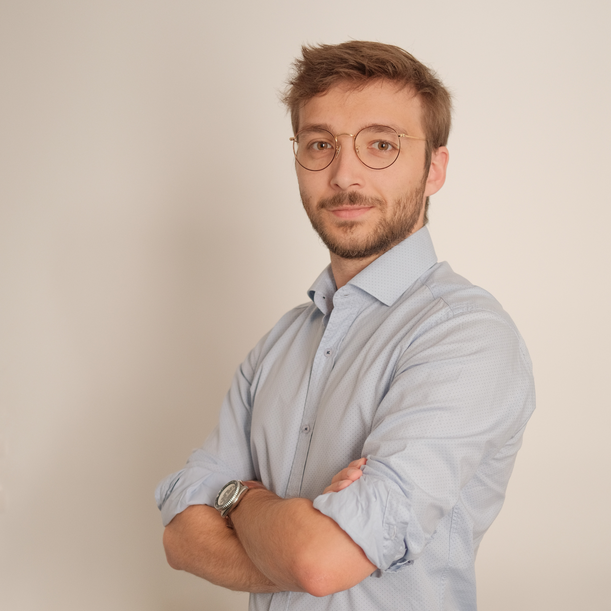

[Alexandre Daby-Seesaram](https://alexandredabyseesaram.github.io), who recently defended his PhD at the Paris-Saclay Mechanics Laboratory of École Normale Supérieure de Paris-Saclay, is starting as a postdoc in the team.
He is funded by our recent ANR MLQ-CT project, and will work on model reduction and porting our digital twin pipeline to the clinical environment of our clinical colleagues.
Welcome and good luck, Alexandre!

{width="50%" fig-align="center"}
