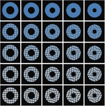

I (with the help of [Philippe Moireau](http://pages.saclay.inria.fr/philippe.moireau) and [Patrick Le Tallec](https://ppi-lms.polytechnique.fr/patrick.letallec)) just introduced a new formulation of the equilibrium gap principle in the context of finite element motion tracking, cf. [https://doi.org/10.5802/crmeca.228](https://doi.org/10.5802/crmeca.228)! The code is available online ([https://gitlab.inria.fr/mgenet/dolfin\_warp](https://gitlab.inria.fr/mgenet/dolfin_warp)), and there are even freely available Jupyter notebooks to reproduce the figures of the paper ([https://mgenet.gitlabpages.inria.fr/N-DEG-paper-demos/index.html](https://mgenet.gitlabpages.inria.fr/N-DEG-paper-demos/index.html)), so do not hesitate to give it a try!!

{width="50%" fig-align="center"}
