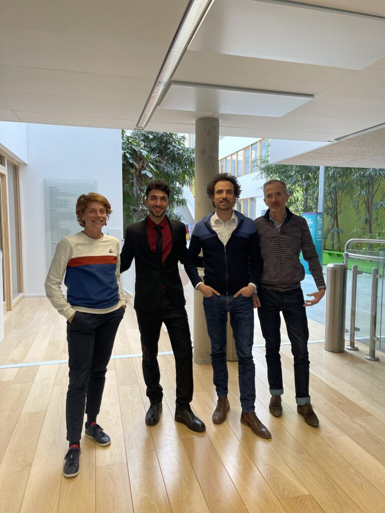

Today [Mahdi Manoochehrtayebi](https://m3disim.saclay.inria.fr/people/mahdi-manoochehrtayebi) defended his PhD thesis!
Jury was composed of:

- [Céline Grandmont](https://team.inria.fr/commedia/grandmont), INRIA (présidente)
- [Adrien Baldit](https://lem3.univ-lorraine.fr/fiche-membre/baldit-adrien/), Université de Lorraine (rapporteur)
- [Emmanuel Baranger](https://lmps.ens-paris-saclay.fr/fr/annuaire-des-personnes/emmanuel-baranger-0), ENS Paris-Saclay (rapporteur)
- [Pauline Assemat](https://www.imft.fr/annuaire/assemat-pauline), Institut de Mécanique des Fluides de Toulouse (examinatrice)
- [Kostantinos Danas](https://www.kostasdanas.com), CNRS (examinateur)
- [Aline Bel-Brunon](https://lamcos.insa-lyon.fr/fiche_personnelle.php?p=33&Numpers=616&L=1), INSA-Lyon (directrice de thèse)
- [Dominique Chapelle](https://m3disim.saclay.inria.fr/people/dominique-chapelle), INRIA (directeur de thèse)
- [Martin Genet](https://m3disim.saclay.inria.fr/people/martin-genet), École Polytechnique (directeur de thèse)

Congrats Mahdi and best wishes for the future!!

{width="50%" fig-align="center"}
