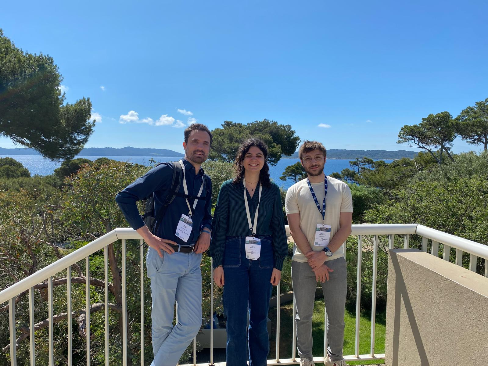

This week we are attending the 16th national workshop on computational mechanics ([https://csma2024.sciencesconf.org](https://csma2024.sciencesconf.org)) in Giens (one of the most beautiful places in France!):

- [Alice Peyraut](https://m3disim.saclay.inria.fr/people/alice-peyraut) presented her PhD work ([Quantification d'incertitudes pour la modélisation pulmonaire personnalisée](https://csma2024.sciencesconf.org/499171))

- [Alexandre Daby-Seesaram](https://m3disim.saclay.inria.fr/alexandre-daby-seesaram) presented his PhD work ([Réduction de modèles en dynamique non-linéaire pour la simulation de structures soumises à une famille de chargements](https://csma2024.sciencesconf.org/531175))

- I presented [Mahdi Manoochehrtayebi](https://m3disim.saclay.inria.fr/people/mahdi-manoochehrtayebi)'s PhD work ([Un modèle micro-poro-mécanique du parenchyme pulmonaire](https://csma2024.sciencesconf.org/507979)) and chaired a session (Biomécanique et ingénierie du vivant)

Also, I was elected a board member of the [French Computational Mechanics Association](https://csma.asso.univ-lorraine.fr).

{width="50%" fig-align="center"}
