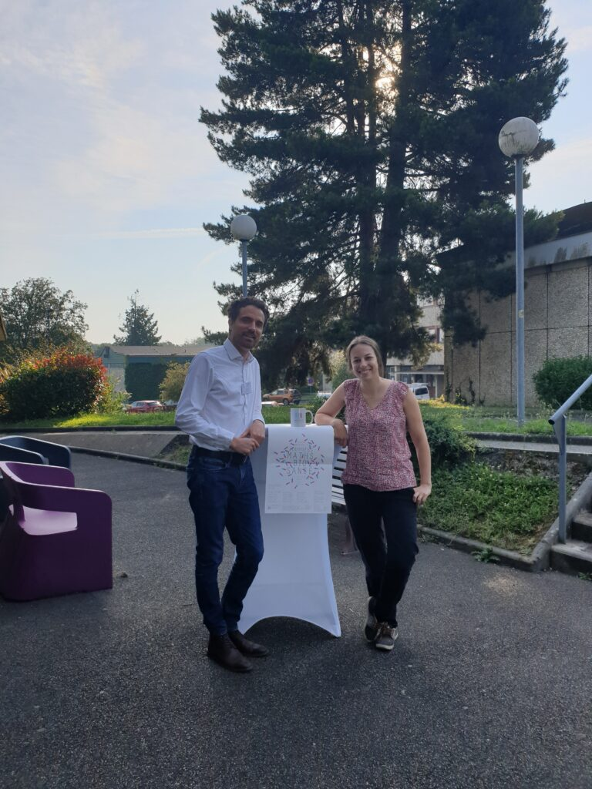

Today I, as an envoy from the GdR Méca-Bio-Santé ([https://gdr-mecabio-sante.cnrs.fr](https://gdr-mecabio-sante.cnrs.fr)), gave a keynote lecture on the team's efforts on "multiscale modeling and estimation of lung poromechanics" during the RT Math-Bio-Santé ([https://math-bio-sante.math.cnrs.fr](https://math-bio-sante.math.cnrs.fr)) 2024 workshop organized at the Henri Lebesgue Center for Mathematics in Nantes ([https://www.lebesgue.fr/fr/JMBS24](https://www.lebesgue.fr/fr/JMBS24))…super nice to see so much interest at the interface —the interphase!— between both communities! And it was an occasion to meet with [Annabelle Collin](https://annabellecollin.perso.math.cnrs.fr), former PhD student in MΞDISIM, who co-organized the meeting and is soon moving to Nantes University as a Professor of Mathematics.

{width="50%" fig-align="center"}
