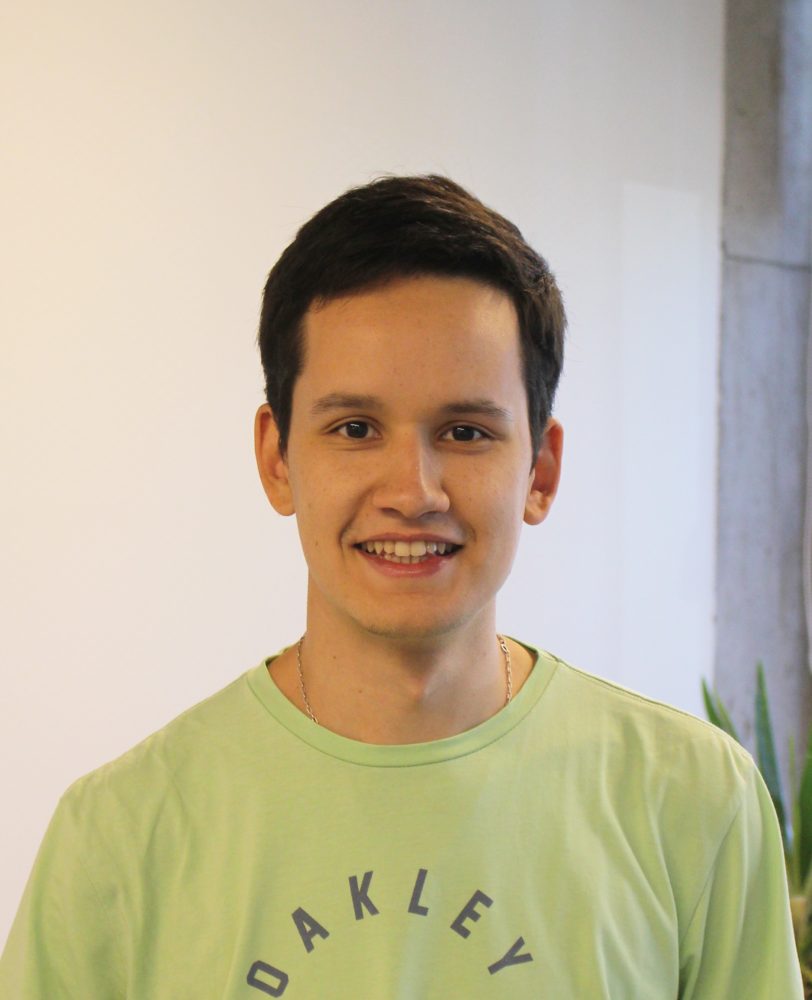

Felipe Álvarez-Barrientos, who holds a Master of Science in Engineering from the _Pontificia Universidad Católica de Chile_ in Santiago, just started his PhD in the team.
He already visited MΞDISIM twice, for his Master thesis and Engineering internship, and together we published [a paper on micro-poro-mechanics](https://doi.org/10.1016/j.ijengsci.2021.103586).
His PhD is funded by the [European Innovation Council PathFinder V|LF-Spiro3D grant](https://v-lf-spiro3d.eu), and he will work on porting our lung personalized modeling/digital twin pipeline to (dynamic) lung magnetic resonance imaging.
Welcome back and good luck, Felipe!

{width="50%" fig-align="center"}
