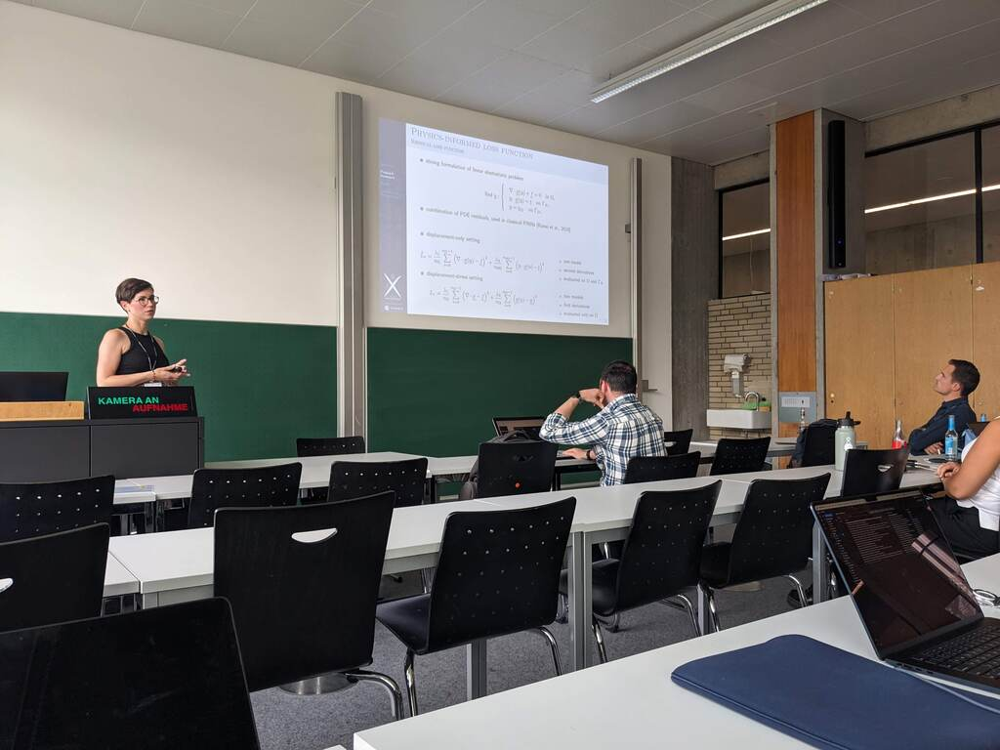

This week we are attending the 2024 Virtual Physiological Human Conference ([VPH2024](https://vph-conference.org)):

- [Kateřina Škardová](https://m3disim.saclay.inria.fr/people/katerina-skardova) presented her work on "Bridging micro to macro in pulmonary mechanics: Interpretable neural networks for surrogate modelling";

{width="50%" fig-align="center"}

- [Alexandre Daby-Seesaram](https://alexandredabyseesaram.github.io) presented his work on "Hybridising standard reduced-order modelling methods with interpretable sparse neural networks for real-time patient specific lung simulations" (including Neural Network PGD);

{width="50%" fig-align="center"}

- I had the chance to inaugurate the Lung Modeling I session with my talk on "Lung multiscale modeling and estimation", and to chair the Lung Modeling II Session.

We also got the chance to meet with old [MΞDISIM](https://m3disim.saclay.inria.fr) members:

- [Federica Caforio](https://scholar.google.it/citations?user=w8yfecAAAAAJ), who is now a University Assistant at the Department of Mathematics and Scientific Computing of the University of Graz, Austria;
- [Maria Gusseva](https://www.linkedin.com/in/maria-s-gusseva), who is now a Postdoctoral Researcher at the UT Southwestern Medical Center in Dallas, USA;
- [Radomir Chabiniok](https://profiles.utsouthwestern.edu/profile/195959/radomir-chabiniok.html), who is now an Associate Professor the UT Southwestern Medical Center in Dallas, USA.

{width="50%" fig-align="center"}

Looking forward to VPH2026 in Milano!