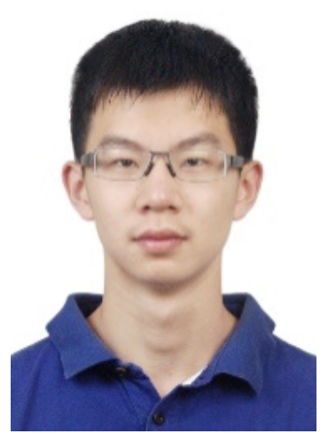

Haotian Xiao, who graduated from _École Centrale de Pékin_ (China) and holds a Master from the _École Nationale des Ponts et Chaussées_ (ENPC, France), just started his PhD in the team.
Funded by the _Institut Polytechnique de Paris_ (IPP) doctoral school, he will work on adding the pulmonary circulation to our lung model, in collaboration with Laurent Savale, David Montani & Marc Humbert from the _Université Paris-Saclay_/INSERM _Hypertension Artérielle Pulmonaire: Physiopathologie et Innovation Thérapeutique_ team and APHP.
Welcome and good luck, Haotian!

{width="50%" fig-align="center"}
