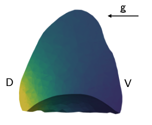

Alice Peyraut and I just published a paper in Biomechanics and Modeling in Mechanobiology (BMMB), introducing new boundary conditions for our lung model, including gravity and more physiological pleural pressure distributions, cf. [https://doi.org/10.1007/s10237-024-01876-w](https://doi.org/10.1007/s10237-024-01876-w) ([editor shared link](https://link.springer.com/epdf/10.1007/s10237-024-01876-w?sharing_token=TuYvGkFwmuPZSLGXMtvdcve4RwlQNchNByi7wbcMAY7Mq3ZVL9usuZLCnim_ByvgmMGt1_bIzml7NUcIAu6T6_JRpn3k-PPYoDLxIoEvRfV4aAoQsV3Uw58Qotc3K6Zk4dEWZo4IYU34MX08NO0Aqh6XH_EMxkXX-07hBqNMKxM%3D), [HAL repository](https://hal.science/hal-04663299)).
As usual now all computations from the paper (which are based on the [dolfin_mech](https://github.com/mgenet/dolfin_mech) FEniCS library) are easily reproducible at [https://apeyraut.gitlabpages.inria.fr/gravity-modeling-paper-demos](https://apeyraut.gitlabpages.inria.fr/gravity-modeling-paper-demos), so do not hesitate to give it a try—let us know how it goes!

{width="50%" fig-align="center"}
