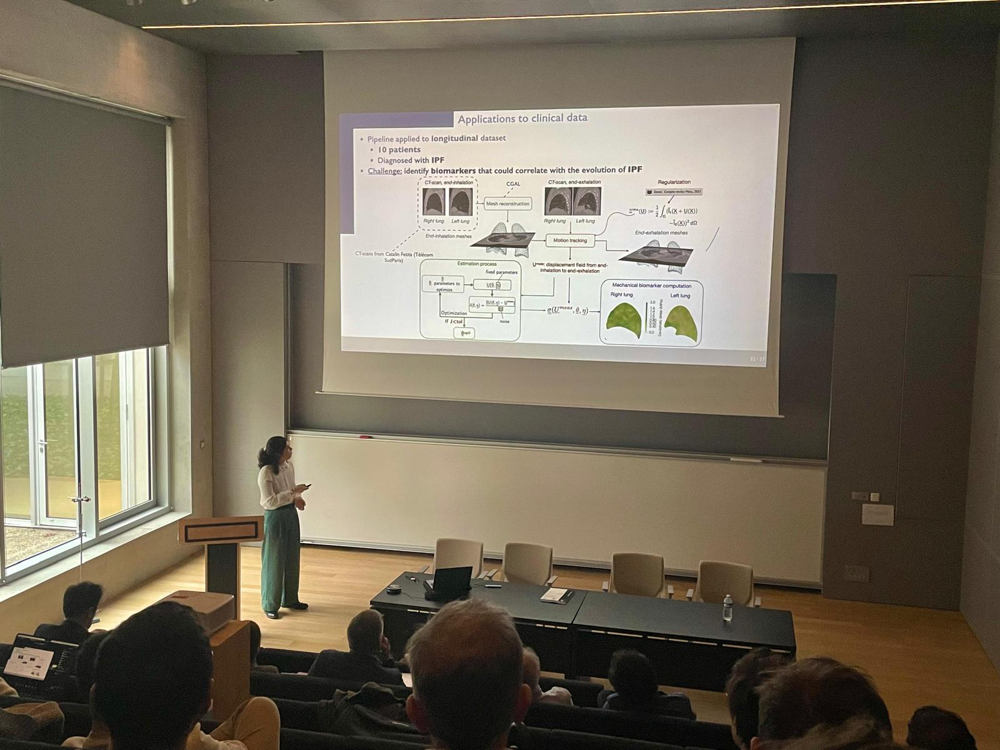

Today Alice Peyraut successfully defended her PhD thesis!
Jury was composed of:

- [Laura De Lorenzis](https://imes.ethz.ch/the-institute/people/person-detail.ldelorenzis.html), ETH Zurich, Switzerland (President)
- [Bing Tie](https://lmps.ens-paris-saclay.fr/fr/annuaire-des-personnes/bing-tie), Laboratoire de Mécanique Paris-Saclay (LMPS), Centrale Supélec, Gif-sur-Yvette (Reviewer)
- [Stéphane Avril](https://www.mines-stetienne.fr/author/avril), Mines Saint-Étienne (Reviewer)
- [Andrei Constantinescu](https://fr.linkedin.com/in/andrei-constantinescu-652b8972), Laboratoire de Mécanique des Solides (LMS), École Polytechnique/CNRS, Palaiseau (Examiner)
- [Jean-François Bernaudin](https://hypoxie.univ-paris13.fr/equipe/37-bernaudin-jean-francois.html), Sorbonne University, Paris (Examiner)
- [Martin Genet](https://mgenet.github.io), École Polytechnique (PhD Director)

Congrats Alice and best wishes for the future!!

{width="50%" fig-align="center"}
