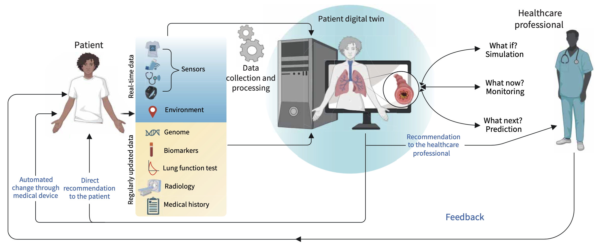

Together with [Apolline Gonsard](https://www.researchgate.net/profile/Gonsard-Apolline) (University Hospital Necker-Enfants Malades) & [David Drummond](https://www.researchgate.net/profile/David-Drummond-2) (University Hospital Necker-Enfants Malades/Université Paris Cité/INSERM/INRIA), we just published a review paper on "Digital twins for chronic lung diseases" in [European Respiratory Review](https://publications.ersnet.org/content/errev), cf. [https://doi.org/10.1183/16000617.0159-2024](https://doi.org/10.1183/16000617.0159-2024).

{width="50%" fig-align="center"}
