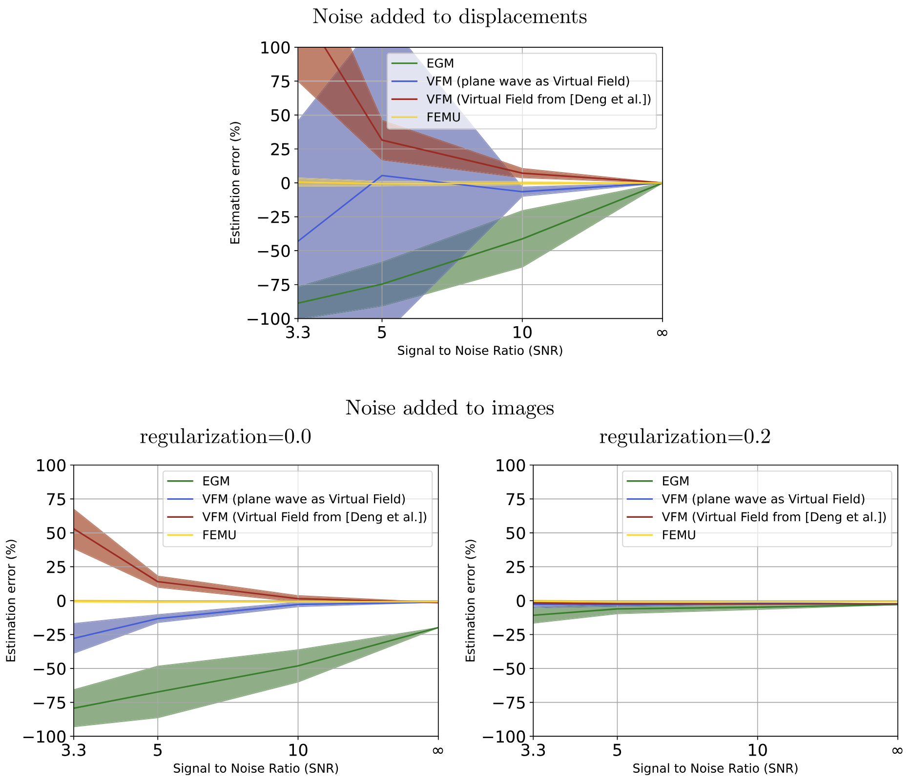

Did you ever dream of identifying model parameters from images without running the model itself?
This is possible!

Alice Peyraut and I just published a paper in _Comptes Rendus Mécanique_, where we use the finite strain formulation of the equilibrium gap principle (introduced in [[Genet, 2024, C. R. Mécanique](https://doi.org/10.5802/crmeca.228)], cf. [dedicated post](../../2024/2024-02-07 - new-paper-on-mechanical-regularization-for-motion-tracking)) to perform direct (i.e., without evaluating the model itself) estimation of model (material and/or loading) parameters from full field measurements.
The method is _a priori_ highly sensitive to noise, but we showed that using the equilibrium gap as regularizer for motion tracking allows to extract displacement fields from dynamic images that are robust enough to be used for direct parameter estimation.
All the details are in the paper: [[Peyraut & Genet, 2025, C. R. Mécanique]](https://doi.org/10.5802/crmeca.279).

All computations from the paper (which are based on the [dolfin_warp](https://github.com/mgenet/dolfin_warp) FEniCS+VTK-based library and the [dolfin_estim](https://gitlab.inria.fr/apeyraut/dolfin_estim) FEniCS-based library) are easily reproducible at [https://apeyraut.gitlabpages.inria.fr/identification-methods-paper-demos](https://apeyraut.gitlabpages.inria.fr/identification-methods-paper-demos), so do not hesitate to give it a try, and let us know how it goes!

{width="80%" fig-align="center"}
