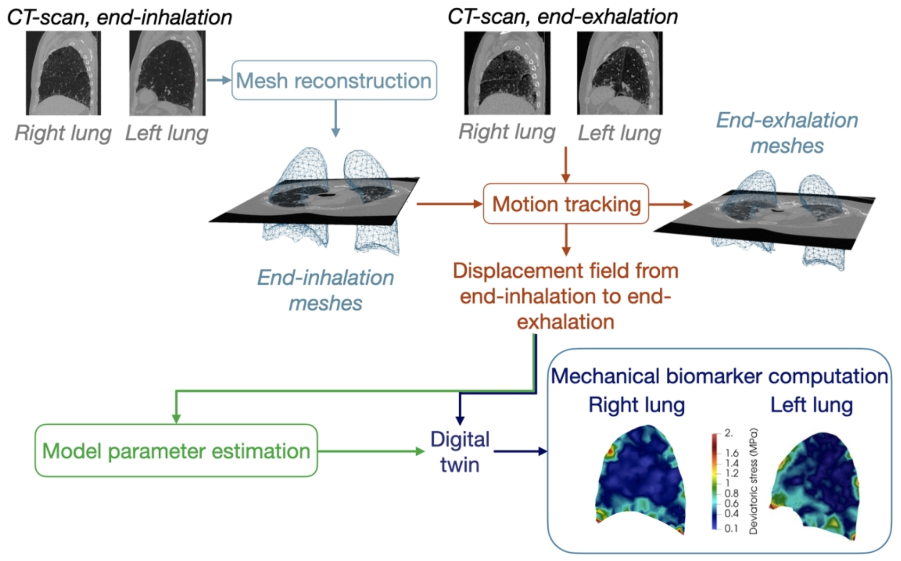

Ever wondered "What is personalized lung poromechanical modeling and how can it improve the understanding and management of fibrotic interstitial lung diseases?"
This is the question the Editor of [Expert Review of Respiratory Medicine](https://www.tandfonline.com/journals/ierx20) asked my colleague Dr. Pierre-Yves Brillet.
And this is our best attempt at answering the question: [[Brillet, Peyraut, Bernaudin, Fetita, Nunes & Genet, 2025, Expert Review of Respiratory Medicine](https://doi.org/10.1080/17476348.2025.2464886)].

{width="80%" fig-align="center"}
