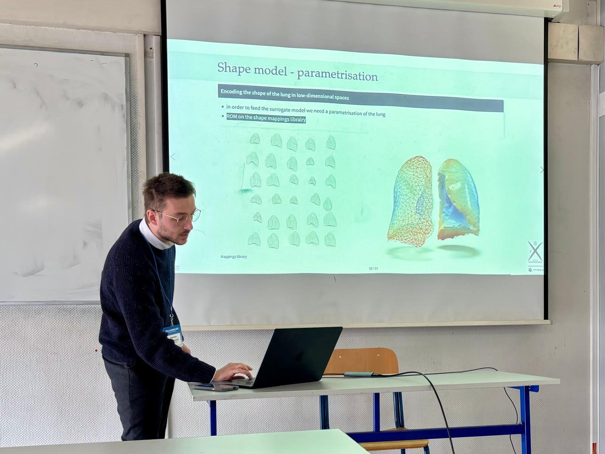
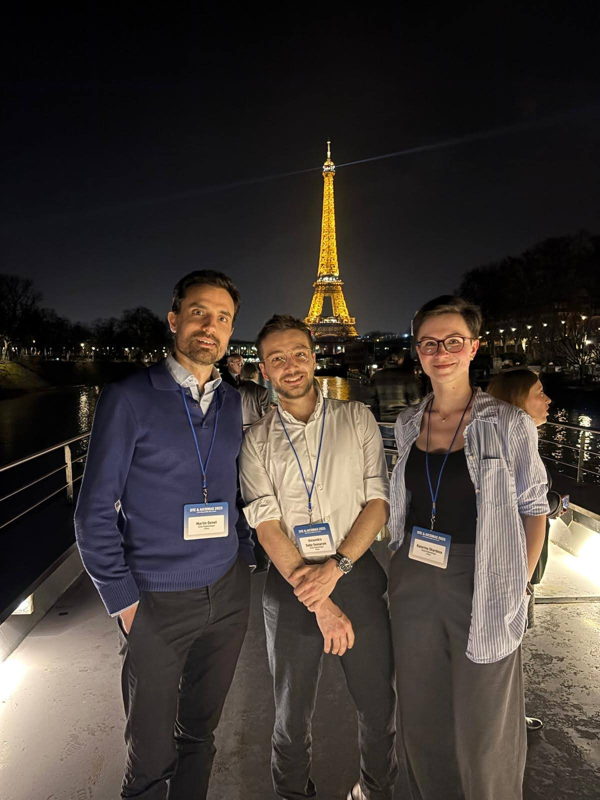

This week we attended the [3rd IACM Digital Twins in Engineering Conference (DTE 2025) &
1st ECCOMAS Artificial Intelligence and Computational Methods in Applied Science (AICOMAS 2025)](https://dte_aicomas_2025.iacm.info) in Paris:

- [Kateřina Škardová](https://www.linkedin.com/in/kate%C5%99ina-%C5%A1kardov%C3%A1-a1a7b4142) presented her work on ["Finite element neural network interpolation: Interpretable and adaptive discretization for solving PDEs"](https://dte_aicomas_2025.iacm.info/event/contribution/93f57dba-8e1e-11ef-b344-000c29ddfc0c);

- [Alexandre Daby-Seesaram](https://alexandredabyseesaram.github.io) presented his work on ["Finite element neural network interpolation: Hybridization with the proper generalized decomposition for surrogate modeling"](https://dte_aicomas_2025.iacm.info/event/contribution/db226dec-8efc-11ef-b344-000c29ddfc0c);

{width="50%" fig-align="center"}

- I co-chaired (together with [Philippe Moireau (MΞDISIM, INRIA & CMAP, École Polytechnique/IPP/CNRS)](http://www.cmap.polytechnique.fr/~philippe.moireau)) a mini-symposium on ["Digital twins of living systems: theoretical, implementation & application challenges"](https://dte_aicomas_2025.iacm.info/event/area/8d4fc12b-710a-11ef-a6b7-000c29ddfc0c), with many exciting talks, cf. Sessions [I](https://dte_aicomas_2025.iacm.info/event/session/23def0ab-b23c-11ef-9e02-000c29ddfc0c) [II](https://dte_aicomas_2025.iacm.info/event/session/246c811a-b23c-11ef-9e02-000c29ddfc0c) and [III](https://dte_aicomas_2025.iacm.info/event/session/24e8f1b8-b23c-11ef-9e02-000c29ddfc0c)—thanks again to all the speakers of the mini-symposium!

{width="50%" fig-align="center"}
