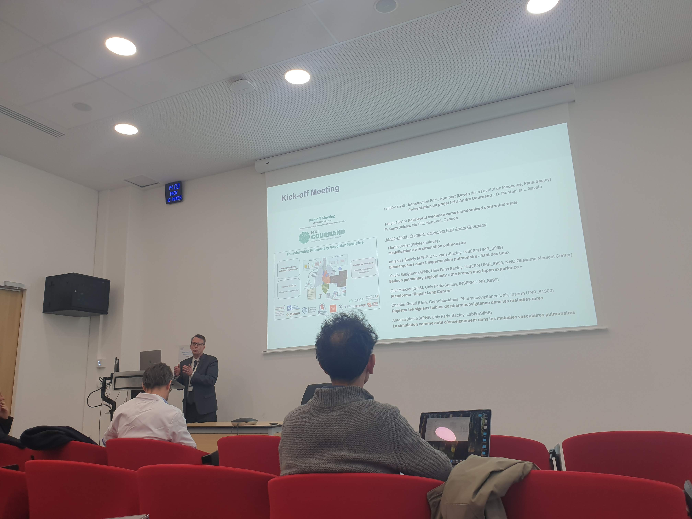
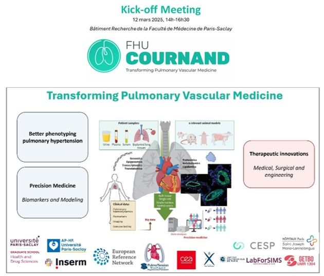
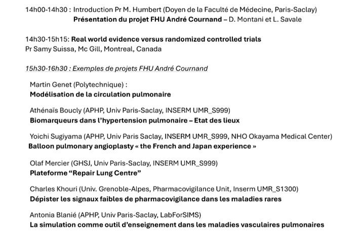

Today was the kick off meeting of the FHU (_Fédération Hospitalo-Universitaire_, i.e., University Hospital Federation) André Cournand (French-American physician and physiologist, Nobel Prize in Physiology and Medicine in 1956 for the development of cardiac catheterization) "Transforming Pulmonary Vascular Medicine".

{width="50%" fig-align="center"}

The FHU, lead by [David Montani](https://www.linkedin.com/in/david-montani-859183119) & [Laurent Savale](https://www.linkedin.com/in/laurent-savale-594754275), is built upon the world-leading [Paris-Saclay University/INSERM/APHP "Pulmonary hypertension: Pathophysiology and therapeutic innovation" research unit](http://www.u999.universite-paris-saclay.fr) lead by Marc Humbert, and aims at establishing "a robust network of clinical teams, basic and translational multidisciplinary research laboratories, engineering teams and platforms to confront emerging challenges in the field of pulmonary vascular diseases".

{width="50%" fig-align="center"}

As a co-leader of the "Biomarkers and Modeling Pulmonary Vascular Diseases" work package of the FHU, I gave a short presentation on our current efforts on lung mechanical modeling, and our plan for modeling pulmonary circulation, notably in the context of [Haotian Xiao](https://www.linkedin.com/in/haotian-xiao-a00771195)'s PhD.
The other presentations were all super impressive, and I am looking forward to see this federation in action!

{width="50%" fig-align="center"}
