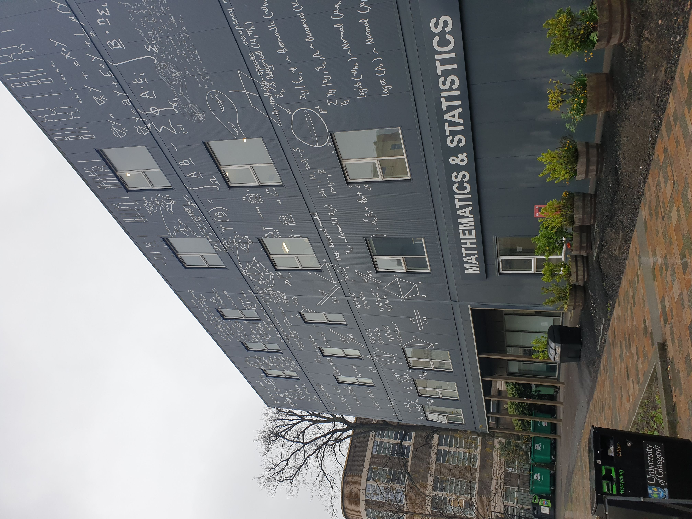

Today I gave a seminar at the School of Mathematics and Statistics of the University of Glasgow, entitled "Toward pulmonary digital twins: recent efforts in motion tracking using mechanical regularization, lung poromechanical modeling and estimation, model reduction using finite element neural networks".
I had the chance to meet many people from the [SofTMech "Mathematics for Healthcare" Center](https://www.softmech.org) (notably Profs. [Nicholas Hill](https://www.gla.ac.uk/schools/mathematicsstatistics/staff/nicholashill) & [Hao Gao](https://www.gla.ac.uk/schools/mathematicsstatistics/staff/haogao) and some of their students), and learn about the excellent work they are doing, notably on cardiac perfusion modeling and simulation, which could very well be useful for our lung perfusion modeling efforts.

{width="50%" fig-align="center"}
