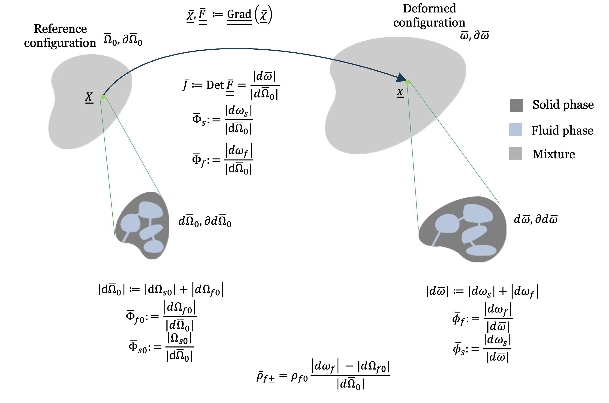

Mahdi Manoochehrtayebi, Aline Bel-Brunon and I just published a paper in the [International Journal of Solids and Structures](https://www.sciencedirect.com/journal/international-journal-of-solids-and-structures) entitled "Finite strain micro-poro-mechanics: formulation and compared analysis with macro-poro-mechanics", cf. [https://doi.org/10.1016/j.ijsolstr.2025.113354](https://doi.org/10.1016/j.ijsolstr.2025.113354) ([editor shared link](https://authors.elsevier.com/a/1l2e84kE0ec2y), [HAL repository](https://hal.science/hal-05057928)).

All computations from the paper (which are based on the [dolfin_mech](https://github.com/mgenet/dolfin_mech) FEniCS-based library) are easily reproducible at [https://mgenet.github.io/Micro-Macro-Poro-paper-demos](https://mgenet.github.io/Micro-Macro-Poro-paper-demos), so do not hesitate to give it a try, and let us know how it goes!

{width="80%" fig-align="center"}
