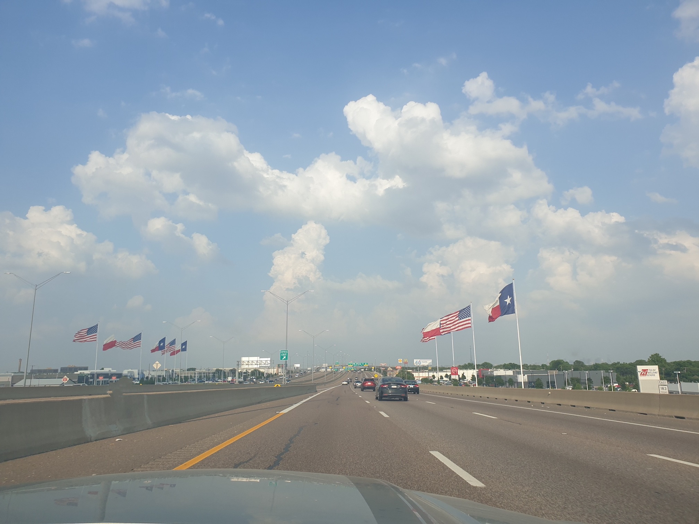

For the next two weeks I will be a Visiting Professor at the University of Texas Southwestern (UTSW) Medical Center in Dallas, invited by [Radomir Chabiniok](https://profiles.utsouthwestern.edu/profile/195959/radomir-chabiniok.html) and [Tarique Hussain](https://utswmed.org/doctors/mohammad-hussain).
This week I will give seminars at the Heart Center (Pediatric Cardiology and Cardiothoracic Surgery Divisions) and Pulmonary & Critical Care Medicine (Internal Medicine Department), and next week I will attend [the 13th Functional Imaging and Modeling of the Heart (FIMH) Conference](https://fimh2025.sciencesconf.org).
It will also be an occasion to visit colleagues at the University of Texas at Austin (UTA) and Oden Institute for Computational Mechanics, notably [Adam Bush](https://www.bme.utexas.edu/people/faculty-directory/bush), [Chad Landis](https://www.ae.utexas.edu/people/faculty/faculty-directory/landis) and [Michael Sacks](https://oden.utexas.edu/people/directory/Michael-Sacks).
Very much looking forward to it!

{width="50%" fig-align="center"}
