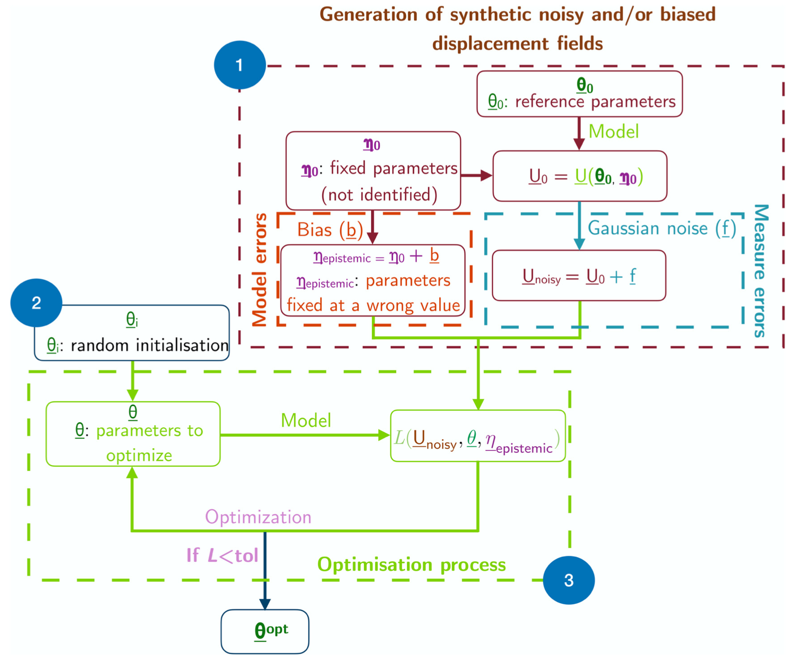

Alice Peyraut and I just published a paper in the [_Journal of Biomechanical Engineering_](https://asmedigitalcollection.asme.org/biomechanical) (a journal of the American Society of Mechanical Engineers, ASME), entitled "Inverse Uncertainty Quantification for Personalized Biomechanical Modeling: Application to Pulmonary Poromechanical Digital Twins", cf. [https://doi.org/10.1115/1.4068578](https://doi.org/10.1115/1.4068578) (HAL repository: [https://hal.science/hal-05118573](https://hal.science/hal-05118573)).

All computations from the paper (which rely on the [dolfin_mech](https://github.com/mgenet/dolfin_mech) FEniCS-based library and the [dolfin_estim](https://github.com/alicepeyraut/dolfin_estim) FEniCS-based library) are easily reproducible at [https://alicepeyraut.github.io/uncertainty-quantification-paper-demos-github](https://alicepeyraut.github.io/uncertainty-quantification-paper-demos-github), so do not hesitate to give it a try, and let us know how it goes!

{width="80%" fig-align="center"}
