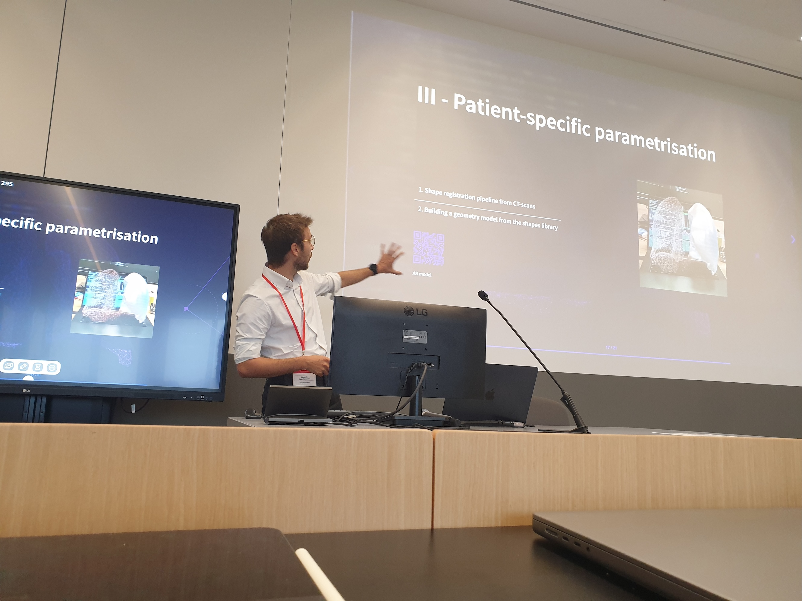
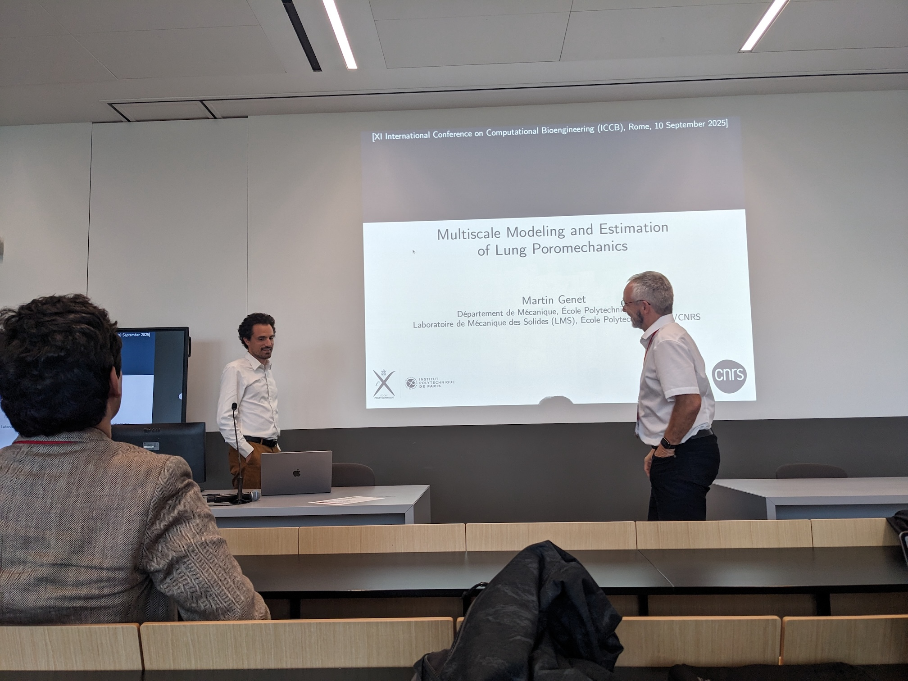

This week we attended the [11th International Conference on Computational Bioengineering (ICCB 2025)](https://iccb2025.org) in Rome:

- [Kateřina Škardová](https://www.linkedin.com/in/kate%C5%99ina-%C5%A1kardov%C3%A1-a1a7b4142) gave the keynote of the "Multiscale biophysical systems. New trends on theoretical and computational modelling" minisymposium, entitled "Finite element neural network interpolation: Interpretable and adaptive discretization for solving PDEs";

- [Alexandre Daby-Seesaram](https://alexandredabyseesaram.github.io) presented his work on "Digital twin of human lungs: towards real-time simulation and registration of soft organs";

{width="50%" fig-align="center"}

- I co-chaired (together with [Daniel Hurtado (Pontificia Universidad Católica de Chile & MIT)](http://www.ing.puc.cl/~dhurtado)) a mini-symposium on "Modeling the respiratory system: current trends and clinical opportunities", and gave a presentation on "Multiscale Modelling and Estimation of Lung Poromechanics".

{width="50%" fig-align="center"}

[Felipe Álvarez-Barrientos](https://www.linkedin.com/in/felipealvarezbarrientos) & [Haotian Xiao](https://www.linkedin.com/in/haotian-xiao-a00771195) also attended the meeting, as well as our colleagues from LMS [Julien Bonnafé](https://www.linkedin.com/in/julien-bonnaf%C3%A9-a06a68355) & [Jean-Marc Allain](https://www.linkedin.com/in/jean-marc-allain-9b84788) who work on the cornea, and our colleague from BioMaps [Quentin Herszkowicz](https://www.linkedin.com/in/quentin-herszkowicz-01145b1b4) with who we collaborate on the lung ([V|LF-Spiro3D EIC project](https://v-lf-spiro3d.eu)).

{width="50%" fig-align="center"}

Such a nice conference—thanks to [Alessio Gizzi](https://www.linkedin.com/in/alessiogizzi) and his team for the perfect organization, and to all speakers of the "respiratory" minisymposium!

{width="50%" fig-align="center"}
