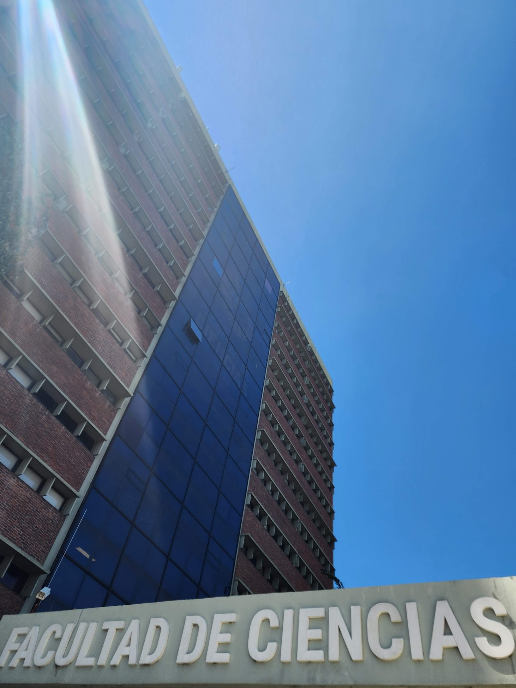

For the next month I will be a Visiting Professor at the [French-Uruguayan Institute for Mathematics and Interactions (IFUMI)](https://irl-ifumi.apps.math.cnrs.fr), a mixed entity of the [Universidad de la República Uruguay (UdelaR)](https://udelar.edu.uy) and [CNRS](https://www.cnrs.fr), hosted by [Franz Chouly](https://fchouly.perso.math.cnrs.fr).
This week (06/11) I will give a seminar (Toward pulmonary digital twins: recent efforts in motion tracking using mechanical regularization, lung poromechanical modeling and estimation, model reduction using finite element neural networks) at the [Facultad de Ciencias](https://www.fcien.edu.uy) & [Facultad de Ingeniería](https://www.fing.edu.uy), and late this month (20/11) I will give a general audience seminar (Mechanics of the heart and lungs—a tale of modeling, computing and learning) at the University.
Very much looking forward to it!

{width="50%" fig-align="center"}

)](ingeniería.jpg){width="50%" fig-align="center"}
