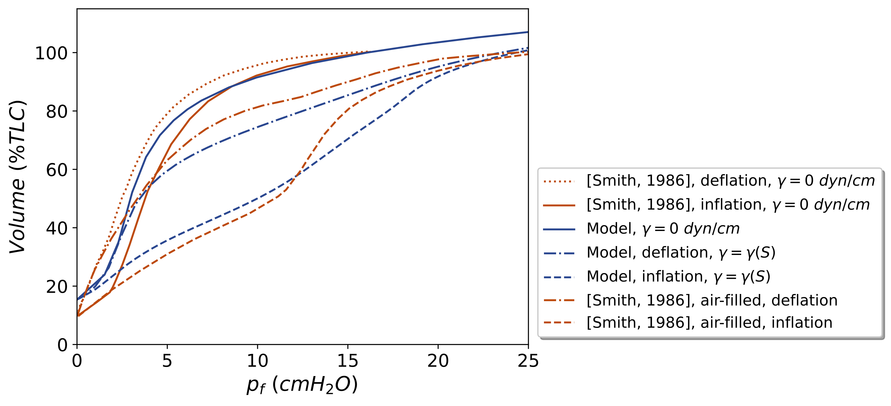

Mahdi Manoochehrtayebi, Aline Bel-Brunon and I just published a paper in the [Journal of Biomechanical Engineering](https://asmedigitalcollection.asme.org/biomechanical) entitled "Micro-Poro-Mechanical Modeling of the Lung Parenchyma: Theoretical Modeling and Parameters Identification", cf. [https://doi.org/10.1115/1.4070036](https://doi.org/10.1115/1.4070036) ([editor shared link](https://smarttrack.kwglobal.com/smarttrack-cl/Download.aspx?sFile=/0BbhmdMnflT5jbtUWW+hyGfKxvdnZ6YuX1eb9/rkjVKChyS2gs0hAds8zUGOxnbJh6bHRDdQu1TY66hSTDoRtiLxBWmpwoI7JZM50tCzvOL4ZAMqTRTnhKqgbpHVs8E6xNuphIP13xLXBoKo1yoz1wKBRkH41WxLaymQjyzQPfvd0FzvLmjYXYK/MaSAVTszF73XThDWzyovJUq2803vA==), [HAL repository](https://hal.science/hal-05298881v1), [preprint](https://sdrive.cnrs.fr/s/KH8x3FwjkMg5gyA)).

It is an extension of our recent paper [[Manoochehrtayebi, Bel-Brunon & Genet (2025). Finite strain micro-poro-mechanics: Formulation and compared analysis with macro-poro-mechanics. International Journal of Solids and Structures, 317, 113354.](https://doi.org/10.1016/j.ijsolstr.2025.113354)], where we specify the micro-model for the lung parenchyma, including (strain- and history-dependent) surface tension, and identifying material parameters based on experimental data from the literature.

All computations from the paper (which are based on the [dolfin_mech](https://github.com/mgenet/dolfin_mech) FEniCS-based library) are easily reproducible at [https://manoochtayebi.github.io/Lung-micro-poro-paper-demos](https://manoochtayebi.github.io/Lung-micro-poro-paper-demos), so do not hesitate to give it a try, and let us know how it goes!

{width="80%" fig-align="center"}
