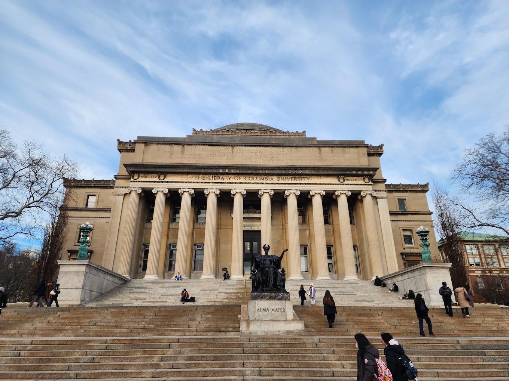
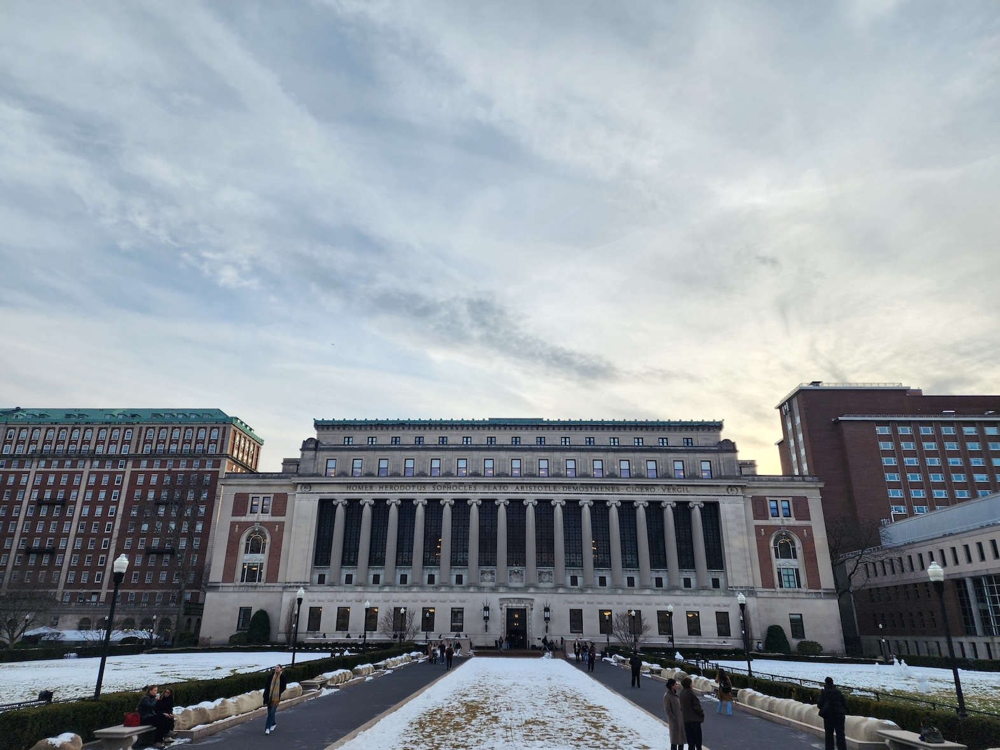
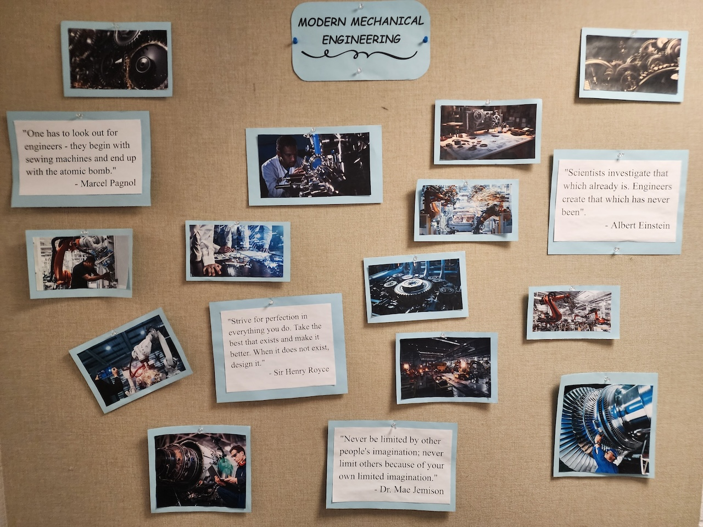
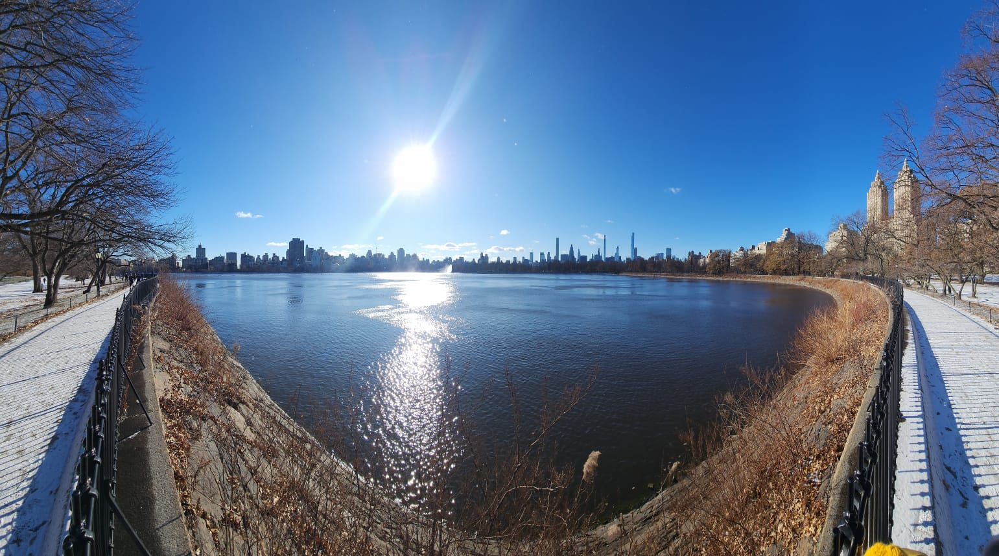
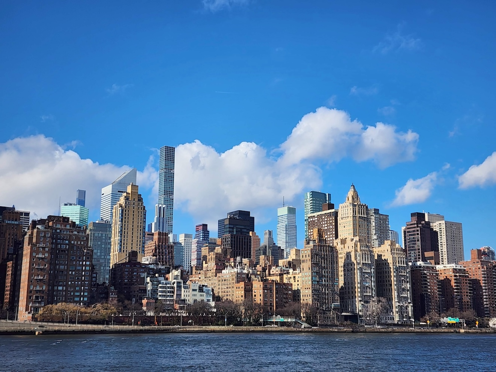
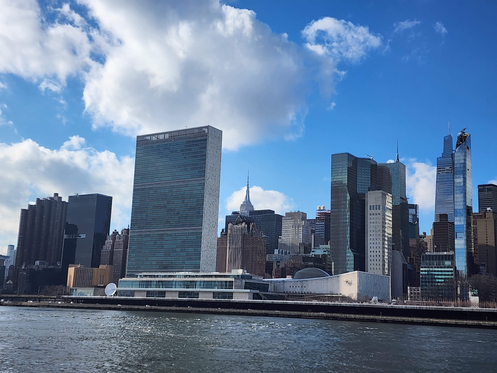

For the next six month I will be a Visiting Professor at [Columbia](https://www.columbia.edu), hosted by [Gerard Ateshian](https://www.me.columbia.edu/faculty/gerard-ateshian) as well as [Kristin Myers](https://www.me.columbia.edu/faculty/kristin-myers) and [Adrian Buganza Tepole](https://www.me.columbia.edu/adrian-buganza-tepole) through the [Alliance Program](https://alliance.columbia.edu).
I will be giving introductory seminars in various group meetings through January, and a full seminar at the Mechanical Engineering Department in February.
I will also take part in various teaching activities (notably Gerard Ateshian's "Mixture theories for biological tissues" class), as well as organize dissemination events with local schools.
This is such a perfect opportunity to share our recent results, learn new topics, and make new connections—very much looking forward to it!

{width="50%" fig-align="center"}

{width="50%" fig-align="center"}

{width="50%" fig-align="center"}

{width="50%" fig-align="center"}

<!-- {width="50%" fig-align="center"} -->

<!-- {width="50%" fig-align="center"} -->
