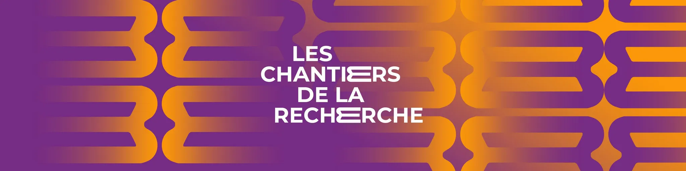

Today [Alexandre Daby-Seesaram](https://alexandredabyseesaram.github.io) (former postdoc in the team, who just started as an Assistant Professor at [ENSTA](https://www.ensta.fr)) talked about our efforts toward pulmonary digital twins on French National Radio during an interview on Guillaume Erner's show "Les chantiers de la recherche"—one of my favorite radio shows, which I highly recommend to all French speakers out there!

Here is the link to the replay: [https://www.radiofrance.fr/franceculture/podcasts/les-chantiers-de-la-recherche/a-quoi-servent-les-jumeaux-numeriques-dans-la-sante-4006852](https://www.radiofrance.fr/franceculture/podcasts/les-chantiers-de-la-recherche/a-quoi-servent-les-jumeaux-numeriques-dans-la-sante-4006852)

Thanks to Alexandre for his flawless pedagogy, and to Guillaume Erner & Juliette Devaux for bringing real science to France Culture's morning show every day!

{width="50%" fig-align="center"}
