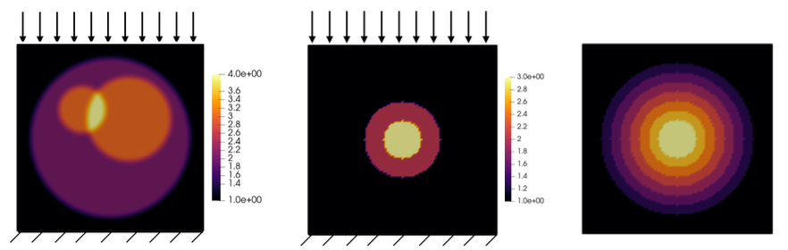

Nagham Chibli, Sébastien Imperial and I just published a paper in [_Comptes Rendus Mécanique_](https://comptes-rendus.academie-sciences.fr/mecanique) entitled "A class of optimal virtual fields for inverse problems in elasticity", cf. [https://doi.org/10.5802/crmeca.361)](https://doi.org/10.5802/crmeca.361).

All computations from the paper are easily reproducible at [https://github.com/nchibli/Optimal-Virtual-Fields-Paper-Demos](https://github.com/nchibli/Optimal-Virtual-Fields-Paper-Demos), so do not hesitate to give it a try, and let us know how it goes!

{width="80%" fig-align="center"}
