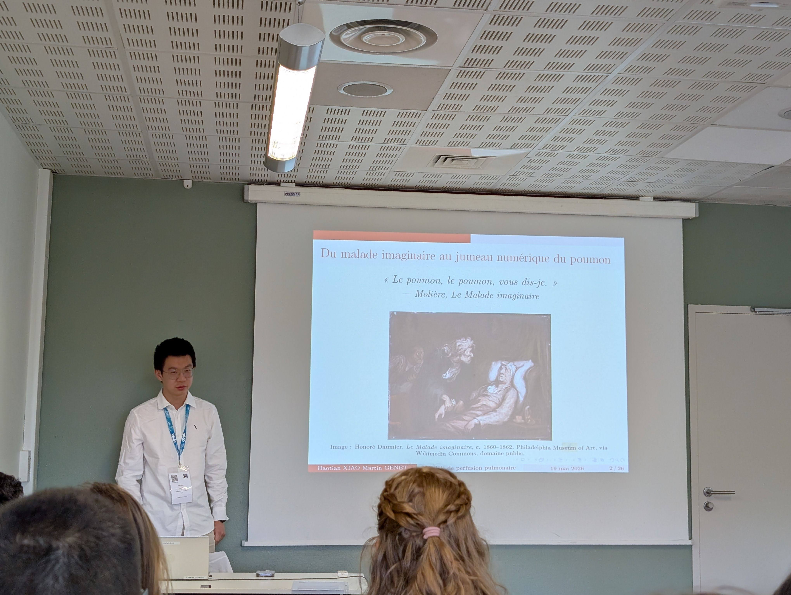
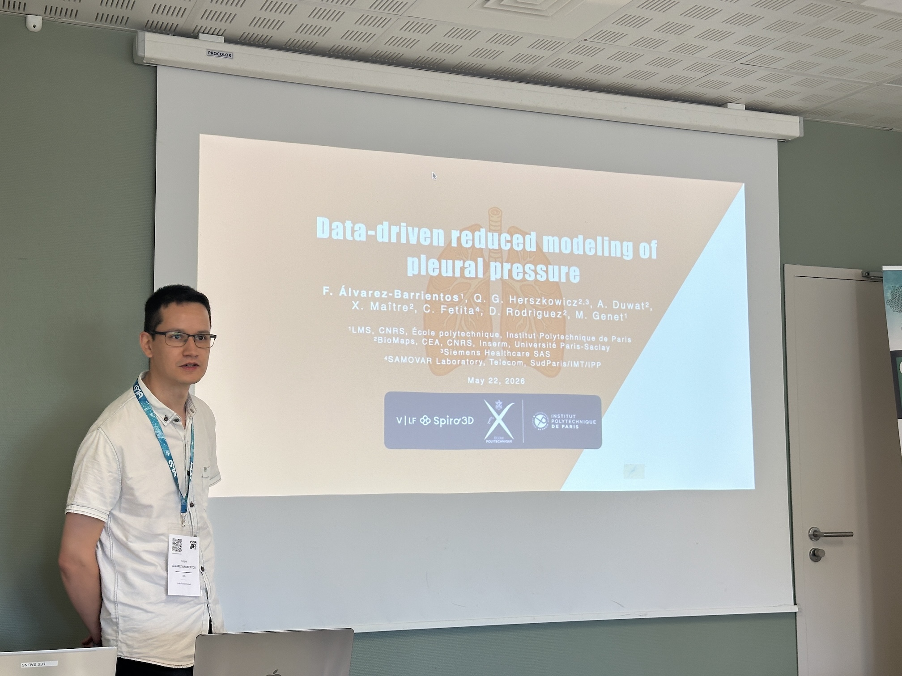
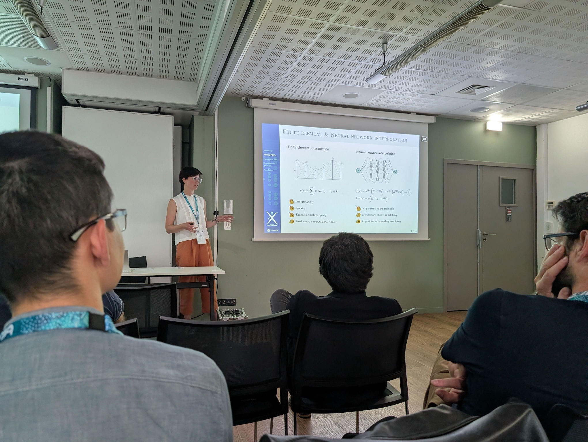
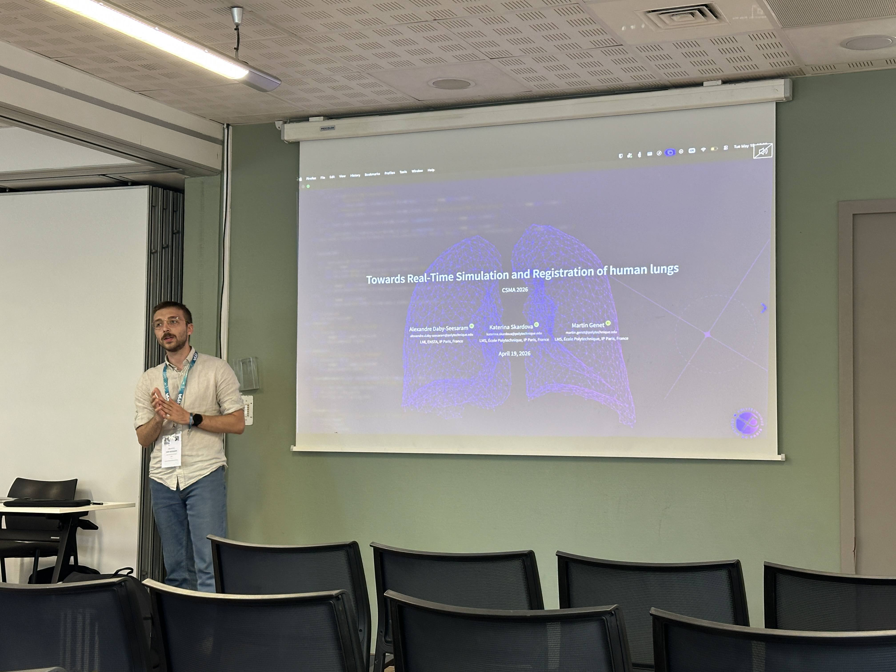
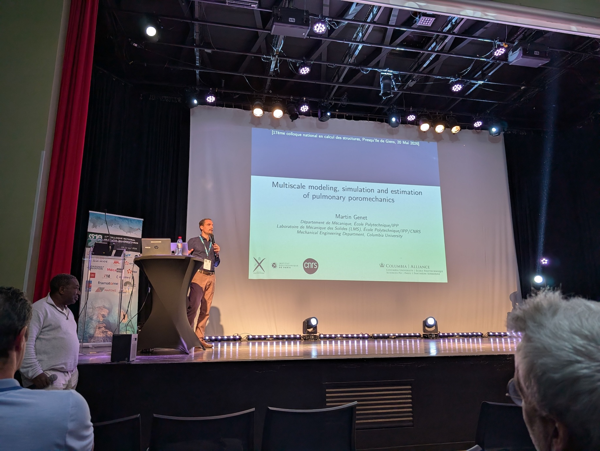
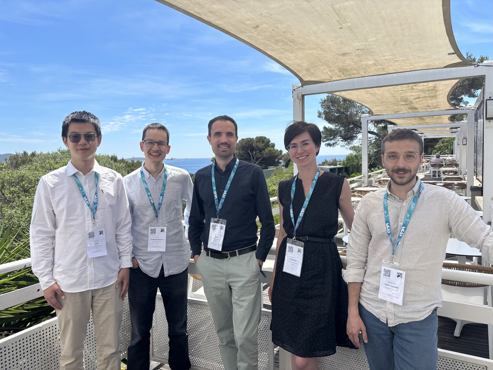

This week we attended the [17th national workshop on computational mechanics](https://csma2026.sciencesconf.org) (my favorite conference!) in Giens (one of my favorite places places in the World!):

- [Haotian Xiao](https://linkedin.com/in/haotian-xiao-a00771195) presented his PhD work on [Dual-porosity modeling of a three-phase microstructure for pulmonary perfusion](https://csma2026.sciencesconf.org/688764) (in French);

{width="66%" fig-align="center"}

- [Felipe Álvarez-Barrientos](https://linkedin.com/in/felipealvarezbarrientos) presented his PhD work on [Data-driven reduced modeling of pleural pressure](https://csma2026.sciencesconf.org/689358);

{width="66%" fig-align="center"}

- [Kateřina Škardová](https://www.linkedin.com/in/kate%C5%99ina-%C5%A1kardov%C3%A1-a1a7b4142) (former PoD in the team, currently PoD at INRIA) presented her work on [NN-PGD for surrogate modeling of PDEs on parametrized domains](https://csma2026.sciencesconf.org/689280);

{width="66%" fig-align="center"}

- [Alexandre Daby-Seesaram](https://alexandredabyseesaram.github.io) (former PoD in the team, currently Assistant Professor at ENSTA) presented his work on [Toward real-time simulation and calibration of a digital model of the human lung](https://csma2026.sciencesconf.org/689293) (in French);

{width="66%" fig-align="center"}

- I gave a plenary talk (!), introduced by Djimedo Kondo (!!), on  "Multiscale modeling, simulation and estimation of pulmonary poromechanics".

{width="66%" fig-align="center"}

Can't wait for CSMA 2028!

{width="80%" fig-align="center"}