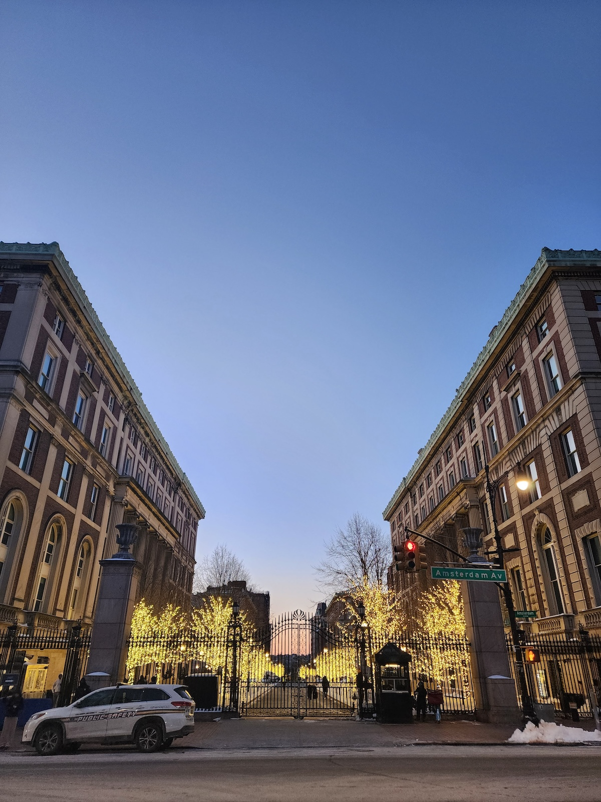
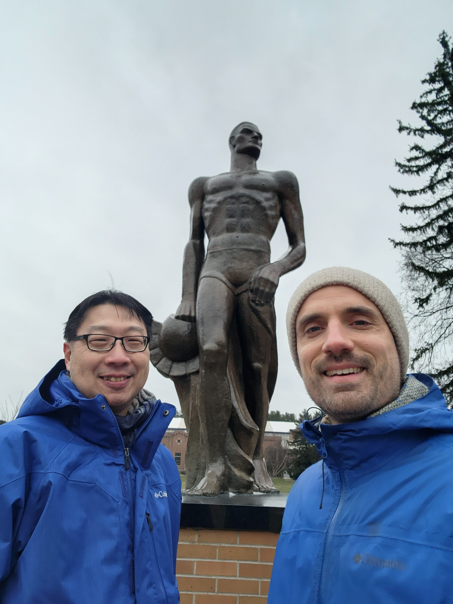
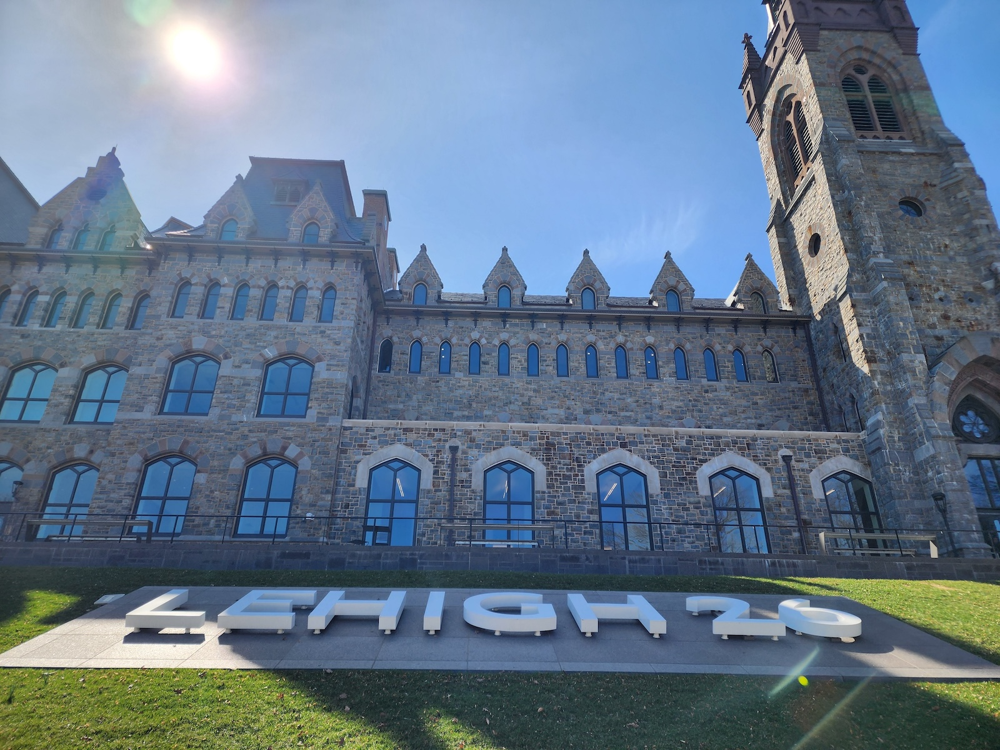
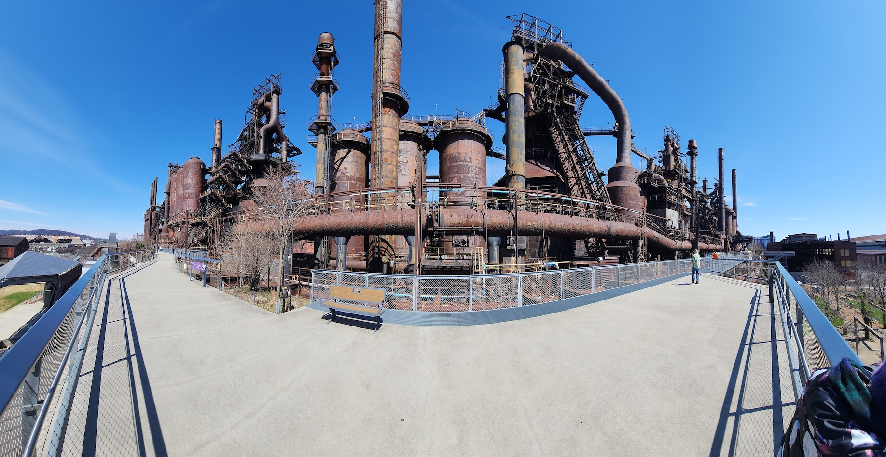
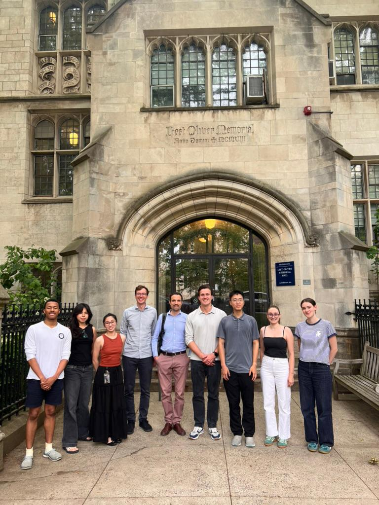
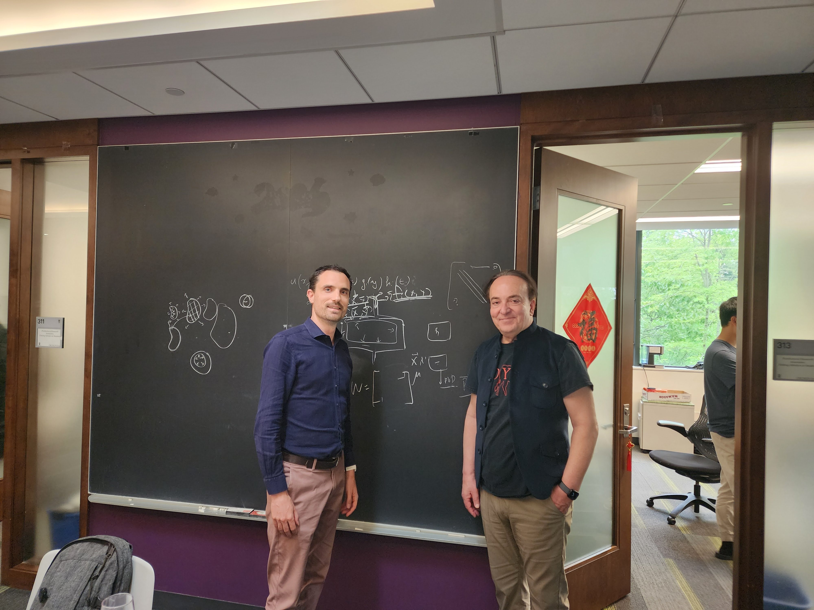
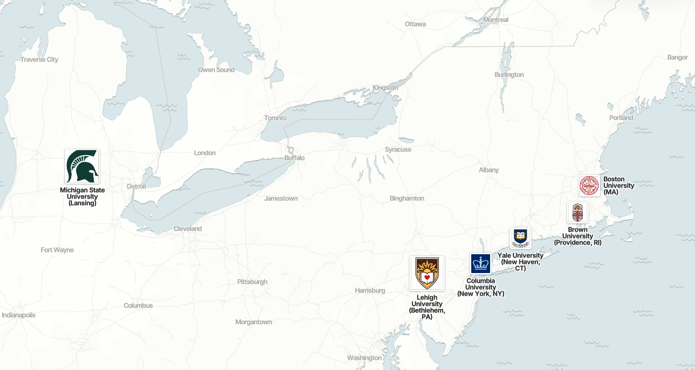

In the past couple of months I have had the chance to give seminars —entitled "Toward pulmonary digital twins: recent efforts in multiscale lung poromechanical modeling, motion tracking and parameter estimation using the equilibrium gap, model reduction using finite element neural networks"— in various universities across the East Coast and Midwest:

- Columbia University, Mechanical Engineering Department, hosted by [Gerard Ateshian](https://www.me.columbia.edu/gerard-ateshian) (plus ad hoc presentations in [Adrian Buganza Tepole](https://www.me.columbia.edu/adrian-buganza-tepole)'s group, [Andrew Laine](https://hbil.bme.columbia.edu/people/andrew-f-laine) & [Elsa Angelini](https://hbil.bme.columbia.edu/people/elsa-d-angelini)'s group, and [Kristin Myers](https://www.me.columbia.edu/kristin-myers)'s group)

{width="50%" fig-align="center"}

- Boston University, [Bela Suki](https://www.bu.edu/eng/profile/bela-suki-ph-d)'s group (also met [Kayhan Batmanghelich](https://www.bu.edu/eng/profile/kayhan-batmanghelich-ph-d) and [Hadi Nia](https://www.bu.edu/eng/profile/hadi-nia-ph-d))

- Michigan State University, Mechanical Engineering Department, hosted by [Lik Chuan Lee](https://engineering.msu.edu/directory/faculty/lclee)

{width="50%" fig-align="center"}

- Lehigh University, Mechanical Engineering Department, hosted by [Natasha Vermaak](https://engineering.lehigh.edu/faculty/natasha-vermaak)

{width="66%" fig-align="center"}

{width="100%" fig-align="center"}

- Yale University, [Martin Pfaller](https://engineering.yale.edu/research-and-faculty/faculty-directory/martin-pfaller)'s group (also met with [Jay Humphrey](https://engineering.yale.edu/research-and-faculty/faculty-directory/jay-humphrey))

{width="50%" fig-align="center"}

- Brown University, [Scientific Computing Seminar Series](https://appliedmath.brown.edu/scientific-computing-seminars), Applied Mathematics Department, hosted by [George Karniadakis](https://engineering.brown.edu/people/george-e-karniadakis) (also met [Jérôme Darbon](https://appliedmath.brown.edu/people/jerome-darbon))

{width="66%" fig-align="center"}

Each seminar was an occasion to share my work, get great feedback, meet old friends, make new connections, engage with the next generation—what a human and scientific blast!

{width="100%" fig-align="center"}
