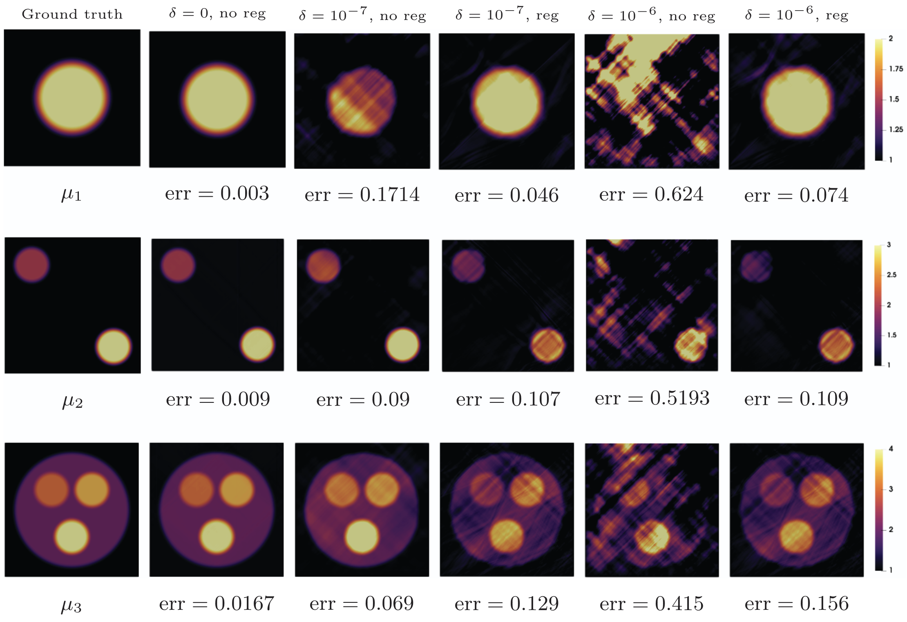

Nagham Chibli, [Sébastien Imperial](https://team.inria.fr/ananke/fr/sebastien-imperiale) and I just published a paper in [Inverse Problems](https://iopscience.iop.org/journal/0266-5611) entitled "Stability analysis of a new curl-based full field reconstruction method in 2D isotropic nearly-incompressible elasticity", cf. [https://doi.org/10.1088/1361-6420/ae6d2e)](https://doi.org/10.1088/1361-6420/ae6d2e).

All computations from the paper are easily reproducible at [https://github.com/nchibli/Curl-Based-Reconstruction-Paper-Demos](https://github.com/nchibli/Curl-Based-Reconstruction-Paper-Demos), so do not hesitate to give it a try, and let us know how it goes!

{width="80%" fig-align="center"}
