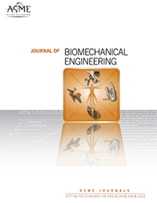

Two of the lab's recent publications have been selected as Editors' Choice Papers and nominated for the 2026 Richard Skalak Award by the associate editors of the [ASME Journal of Biomechanical Engineering](https://asmedigitalcollection.asme.org/biomechanical):
- [[Peyraut & Genet, 2025, Inverse Uncertainty Quantification for Personalized Biomechanical Modeling: Application to Pulmonary Poromechanical Digital Twins, Journal of Biomechanical Engineering.](https://doi.org/10.1115/1.4068578)]
- [[Manoochehrtayebi, Genet & Bel-Brunon, 2026, Micro-Poro-Mechanical Modeling of the Lung Parenchyma: Theoretical Modeling and Parameters Identification, Journal of Biomechanical Engineering.](https://doi.org/10.1115/1.4070036)]
You can read the full editorial announcement [here](https://asmedigitalcollection.asme.org/biomechanical/article/148/7/070301/1233289/The-2026-Richard-Skalak-Award-and-Editors-Choice)—many thanks to the Associate Editors, and congratulations to my co-authors, the other nominees, and the awardees of the 2026 Richard Skalak Award!

{width="50%" fig-align="center"}
