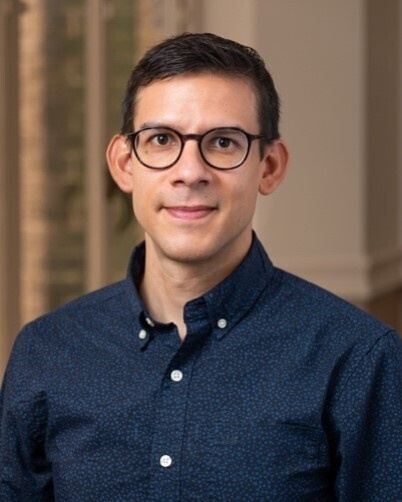

[Adrian Buganza Tepole](https://www.me.columbia.edu/adrian-buganza-tepole), Associate Professor in the [Department of Mechanical Engineering](https://me.columbia.edu) at [Columbia University](https://www.columbia.edu), is joining us as a Visiting Professor at [École Polytechnique](https://www.polytechnique.edu) in the [Solid Mechanics Laboratory](https://lms.ip-paris.fr) (LMS).
He will be visiting in two sessions, August 17–30 and then November 9–29, to further extend our collaboration around surrogate modeling of soft tissue growth.
Welcome to Palaiseau, Adrian!

{width="50%" fig-align="center"}
